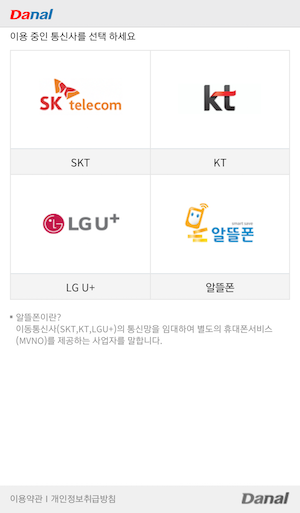
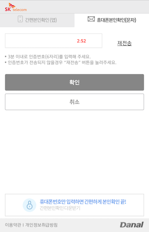

# intro  
고객이 사용 중인 통신사를 통해 SMS로 전송된 인증번호(6자리)를 입력하면 해당 고객의 이름 / 생년월일 / 성별을 확인해주는 기능입니다.  

  

## 1. 설치  
아임포트 javascript는 jQuery의 기능을 활용하여 구현되어 있습니다.  
사용되는 모든 jQuery의 기능은 jQuery 1.0버전부터 제공되는 기본 기능이므로 원하시는 jQuery의 버전을 사용하시면 됩니다.  

아임포트 javascript 1.1.4버전부터 SMS본인인증기능이 제공됩니다. 

```html
<script type="text/javascript" src="https://code.jquery.com/jquery-1.12.4.min.js" ></script>
<script type="text/javascript" src="https://service.iamport.kr/js/iamport.payment-1.1.4.js"></script>
```  


## 2. 본인인증화면 호출  
```javascript
IMP.init('가맹점식별코드'); // 아임포트 관리자 페이지의 "시스템 설정" > "내 정보" 에서 확인 가능
```  

`IMP.init('가맹점식별코드')` 은 일찍 호출해두시면 좋습니다. (ex. DOM Ready 혹은 페이지 로딩 후)  

```javascript
IMP.certification({
    merchant_uid : 'merchant_' + new Date().getTime() //본인인증과 연관된 가맹점 내부 주문번호가 있다면 넘겨주세요
}, function(rsp) {
    if ( rsp.success ) {
    	 // 인증성공
        console.log(rsp.imp_uid);
        console.log(rsp.merchant_uid);
        
        $.ajax({
				type : 'POST',
				url : '/certifications/confirm',
				dataType : 'json',
				data : {
					imp_uid : rsp.imp_uid
				}
		 }).done(function(rsp) {
		 		// 이후 Business Logic 처리하시면 됩니다.
		 });
        	
    } else {
    	 // 인증취소 또는 인증실패
        var msg = '인증에 실패하였습니다.';
        msg += '에러내용 : ' + rsp.error_msg;

        alert(msg);
    }
});
```

`IMP.certification(param, callback)` 는 2개의 argument를 받는 함수입니다.  

### 2.1 param 속성  
| 속성명 | 타입(typeof) | 설명 | 기본값  | 비고 | 지원버전 |
|---|---|---|---|---|---|
| merchant_uid | string | 가맹점에서 생성/관리하는 고유 주문번호 | random | (선택항목) |1.1.4부터|  
| min_age | number | 본인인증시 최소 나이를 필요로하는 경우 제할할 최소 나이  | undefined | (선택항목) 생년월일을 고려하여 만 나이로 기재. <br>ex) 1990년 3월 1일이 생일인 경우, 2017년 2월 1일에 본인인증 시도하면 min\_age:26(본인인증성공) / min\_age:27(본인인증실패) |1.1.4부터|  
| popup | boolean | 본인인증창을 새창(window)에서 동작시킬지 여부  | false | 기존 화면에 상단 Layer로 본인인증창이 띄워지는 것이 기본이지만, 새창(window)를 열어 본인인증창을 띄우고 싶은 경우 true로 지정 |1.1.6부터|  

### 2.2 callback의 구성  
```javascript
function(rsp) {
    if ( rsp.success ) {
        // 인증성공
        console.log(rsp.imp_uid);
        console.log(rsp.merchant_uid);
    } else {
    	 // 인증취소 또는 인증실패
        var msg = '인증에 실패하였습니다.';
        msg += '에러내용 : ' + rsp.error_msg;

        alert(msg);
    }
}
```  

| rsp 속성명 | 타입(typeof) | 설명 | 비고 |
|---|---|---|---|
| success | boolean | 본인인증이 성공적이었는지 여부 | true / false |
| error_code | string | 본인인증에 실패한 경우 단축메세지 | 현재 코드체계는 없음 |
| error_msg | string | 본인인증에 실패한 경우 상세메세지 | |
| imp_uid | string | 아임포트 본인인증결과 고유 번호 | 아임포트에서 부여하는 본인인증 건 당 고유한 번호 |
| merchant_uid | string | 가맹점에서 생성/관리하는 고유 주문번호 | |  

## 3. REST API로 본인인증결과 확인하기  

`IMP.certification(param, callback)`으로 본인인증이 성공한 다음, 상세 정보(이름/생년월일/성별)정보를 확인하기 위해서는 서버사이드에서 REST API를 호출해 본인인증결과를 조회하셔야 합니다.  

```bash
curl -H "Content-Type: application/json" \
    https://api.iamport.kr/certifications/{imp_uid}
```

보다 상세한 REST API명세는 [https://api.iamport.kr](https://api.iamport.kr) 에서 확인해주세요.  

