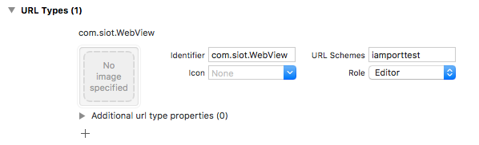

# General Payment Integration by PG

:globe_with_meridians: [KO](/인증결제/README.md)  

Create an i'mport account following the [Setup](https://docs.iamport.kr/en-US/prepare) guide in the i'mport Documentation, and use the following PG integration guides to perform a test payment in each PG’s test account.<Br />

ℹ️ To better understand Korea's e-payment service flow, refer to [Korean E-payment Service Flow](background.md).

The following PG integration guides cover only the contents specific to each PG. For common settings and sample codes, refer to [Common PG Integration Guideline](#common-guideline) below.

- [Alipay](./sample/alipay.md)
- [Blue Walnut](./sample/bluewalnut.md)
- [CHAI](./sample/chai.md)
- [Danal](./sample/danal.md)
- [Eximbay](./sample/eximbay.md)
- [KG INICIS](./sample/inicis.md)
- [JTNet](./sample/jtnet.md)
- [Kakao Pay](./sample/kakao.md)
- [NHN KCP](./sample/kcp.md)
- [KICC](./sample/kicc.md)
- [NICE Payments](./sample/nice.md)
- [PAYCO](./sample/payco.md)
- [PayPal](./sample/paypal.md)
- [Settlebank](./sample/settle.md)
- [SmilePay](./sample/smilepay.md)
- [Toss Payments](./sample/uplus.md)
- [Naver Pay](/en/NAVERPAY/sample/naverpay-pg.md)
  
# Common PG Integration Guideline <a id="common-guideline" />

- [1. PC/Mobile web integration](#pc-mobile)
	- [1.1 Callback](#callback)
	- [1.2 Redirect](#redirect)
- [2. Mobile App WebView integration](#webview)
	- [2.1 Merchant app -> payment app](#my-to-3rd)
		- [2.1.a Android](#my-to-3rd-android)
		- [2.1.b iOS](#my-to-3rd-ios)
	- [2.2 Payment app -> Merchant app](#3rd-to-my)
		- [2.2.a Android](#3rd-to-my-android)
		- [2.2.b iOS](#3rd-to-my-ios)
	- [2.3 Cookie Settings](#cookie)	
		- [2.3.a Android](#cookie-android)
		- [2.3.b iOS](#cookie-ios)
	- [2.4 Show alert/confirm popup](#alert)	
		- [2.4.a Android](#alert-android)
		- [2.4.b iOS](#alert-ios)


<a id="pc-mobile"></a>

## 1. PC/Mobile web integration

Call each PG's payment window. After the payment process is completed, post processing, such as receiving payment information, is performed through **callback or redirect** as follows.


ℹ️ For detailed information, refer to the [General Payments](https://docs.iamport.kr/en-US/implementation/payment#start-payment) guide.

ℹ️ For easy and quick integration of i'mport REST APIs, use the open source [REST API client modules](https://github.com/iamport/iamport-rest-client) provided in various languages by developers using i'mport services.

<a id="callback"></a>

### 1.1 Callback

- Sample code to call the payment window via callback `client-side`

```javascript
IMP.request_pay({
    pg : 'html5_inicis',
    pay_method : 'card',
    merchant_uid : "{Merchant created Order ID}", // Example: order_no_0001
    name : 'Order name: payment test',
    amount : 14000,
    buyer_email : 'iamport@siot.do',
    buyer_name : 'John Doe',
    buyer_tel : '010-1234-5678',
    buyer_addr : 'Shinsa-dong, Gangnam-gu, Seoul',
    buyer_postcode : '123-456'
}, function(rsp) {
    if ( rsp.success ) {
    	//[1] Pass imp_uid using jQuery ajax to retrieve payment information from the server
    	jQuery.ajax({
    		url: "/payments/complete", //Be cautious about cross-domain error
    		type: 'POST',
    		dataType: 'json',
    		data: {
	    		imp_uid : rsp.imp_uid
	    		//Add other required data as needed
    		}
    	}).done(function(data) {
    		//[2] Server-side payment amount check via REST API and service processing are successful
    		if ( everythings_fine ) {
    			var msg = 'Payment successful.';
    			msg += '\Payment ID: ' + rsp.imp_uid;
    			msg += '\nOrder ID: ' + rsp.merchant_uid;
    			msg += '\Payment amount: ' + rsp.paid_amount;
    			msg += 'Credit card authorization number: ' + rsp.apply_num;
    			
    			alert(msg);
    		} else {
    			//[3] Payment is not complete.
    			//[4] Payment amount check failed -> payment has been automatically cancelled.
    		}
    	});
    } else {
        var msg = 'Payment failed.';
        msg += 'Error: ' + rsp.error_msg;
        
        alert(msg);
    }
});
```

- Pseudo code to extract payment information from Ajax POST request and perform post-processing `server-side`

```
imp_uid = extract_POST_value_from_url('imp_uid') //Get imp_uid from post ajax request

payment_result = rest_api_to_find_payment(imp_uid) //Get payment information from i'mport server using imp_uid
amount_to_be_paid = query_amount_to_be_paid(payment_result.merchant_uid) //Get original requested payment amount (associated with merchant_uid on the merchant server).

IF payment_result.status == 'paid' AND payment_result.amount == amount_to_be_paid
	success_post_process(payment_result) //Handle successful payment
ELSE IF payment_result.status == 'ready' AND payment.pay_method == 'vbank'
	vbank_number_assigned(payment_result) //Virtual account issued successfully
ELSE
	fail_post_process(payment_result) //Handle failed payment

```


<a id="redirect"></a>

### 1.2 Redirect

- Sample code to call the payment window via redirect `client-side`

```javascript
IMP.request_pay({
    pg : 'chai',
    pay_method : 'trans',
    merchant_uid : "{Merchant created Order ID}", // Example: order_no_0001
    name : 'Order name: payment test',
    amount : 14000,
    buyer_email : 'iamport@siot.do',
    buyer_name : 'John Doe',
    buyer_tel : '010-1234-5678',
    buyer_addr : 'Shinsa-dong, Gangnam-gu, Seoul',
    buyer_postcode : '123-456'
    m_redirect_url : '{URL to redirect to after payment approval on Mobile}' // Example: https://www.my-service.com/payments/complete/mobile
}, function(rsp) {
    if ( !rsp.success ) {
    	//When an error occurs before page is redirected to the checkout page
        var msg = 'An error occurred before initiating payment.';
        msg += 'Error: ' + rsp.error_msg;

        alert(msg);
    }
});
```

- Pseudo code to extract payment information from the redirect URL's query string and perform post-processing `server-side`

```
imp_uid = extract_GET_value_from_url('imp_uid') //Get imp_uid from the query string
//merchant_uid = extract_GET_value_from_url('merchant_uid') //Get merchant_uid from the query string (optional)

payment_result = rest_api_to_find_payment(imp_uid) //Get payment information from i'mport server using imp_uid
amount_to_be_paid = query_amount_to_be_paid(payment_result.merchant_uid) //Get original requested payment amount (associated with merchant_uid on the merchant server)

IF payment_result.status == 'paid' AND payment_result.amount == amount_to_be_paid
	success_post_process(payment_result) //Handle successful payment
ELSE IF payment_result.status == 'ready' AND payment.pay_method == 'vbank'
	vbank_number_assigned(payment_result) //Virtual account issued successfully
ELSE
	fail_post_process(payment_result) //Handle failed payment
```

<a id="webview"></a>

## 2. Mobile App WebView integration

ℹ️ For easy and quick payment integration in Android/iOS native apps, use the i'mport [Mobile Native SDKs](https://docs.iamport.kr/en-US/sdk/mobile-sdk).

Use the [redirect](#redirect) method for PC/mobile web integration to call a PG payment window from the merchant app's WebView and perform post processing after payment approval.  

<a id="app_scheme"></a>
**For iOS**, to return to the merchant app after payment approval, you need to specify the **merchant app scheme** value in the `param.app_scheme` parameter of the ([IMP.request_pay(param, callback)](https://docs.iamport.kr/en-US/sdk/javascript-sdk#request_pay)) function.   

`app_scheme` supports the following two formats:

-	`iamporttest`: specify URL scheme only (`iamporttest://` called).
-	`iamporttest://path?query`: specify parameter to receive from payment app (called as is)


```javascript
IMP.request_pay({
	/*...Omitted... */
	app_scheme: 'iamporttest' // merchant app's URL scheme
})
```

Payment approval requires configuration and implementation for navigating between apps as follows:  

1. Merchant app -> payment app
2. Payment app -> merchant app


<a id="my-to-3rd"></a>

## 2.1 Merchant app -> payment app

<details>
<summary>Key payment app URL schemes</summary>

| URL Scheme | App |
| ---------- | - |
| ansimclick | 삼성카드-온라인결제 |
| ansimclickipcollect | 삼성카드-온라인결제 |
| ansimclickscard | 삼성카드-온라인결제 |
| chaipayment | 차이앱 |
| citicardappkr | 씨티카드-공인인증 앱 |
| citimobileapp | 씨티카드-간편결제 |
| citispay | 씨티카드-앱카드 |
| cloudpay | 하나카드-앱카드 |
| com.wooricard.wcard | 우리WON페이 |
| hanamopmoasign | 하나카드-공인인증 앱 |
| hanawalletmembers | 하나카드-하나멤버스 월렛 |
| hdcardappcardansimclick | 현대카드-앱카드 |
| hyundaicardappcardid | 현대카드 |
| ispmobile | ISP모바일 |
| itms-apps | 앱스토어 |
| kakaotalk | 카카오페이 |
| kb-acp | 국민카드-앱카드 |
| kb-auth | 국민 |
| kftc-bankpay | 계좌이체 |
| lguthepay-xpay | 페이나우 |
| liivbank | 국민 Liiv M(리브모바일) |
| lmslpay | 롯데 L.pay 앱 |
| lotteappcard | 롯데카드-앱카드 |
| lottesmartpay | 롯데카드-모바일결제 |
| Lpayapp | (구)롯데 L.pay 앱 |
| mpocket.online.ansimclick | 삼성카드-앱카드 |
| NewSmartPib | 우리WON뱅킹 |
| nhallonepayansimclick | 농협-올원페이 |
| nhappcardansimclick | 농협-앱카드 |
| nonghyupcardansimclick | 농협카드-공인인증 앱 |
| payco | 페이코 |
| samsungpay | 삼성카드-삼성페이 |
| scardcertiapp | 삼성카드-공인인증서 |
| shinhan-sr-ansimclick | 신한카드-앱카드 |
| smhyundaiansimclick | 현대카드-공인인증 앱 |
| smshinhanansimclick | 신한카드-공인인증 앱 |
| supertoss | 토스 |
| vguardstart | 삼성카드-백신 |
| wooripay | 우리카드-앱카드 |
</details>

### 2.1.a Android <a id="my-to-3rd-android"></a>

In the WebView of the merchant app, implement logic to call each PG's payment app and check if the app is installed.<Br />

Override the `shouldOverrideUrlLoading` method of the [WebViewClient](https://developer.android.com/reference/android/webkit/WebViewClient.html) class as follows:


```java
public class MyViewClient extends WebViewClient {

	@Override
	public boolean shouldOverrideUrlLoading(WebView view, String url) {
		if (!url.startsWith("http://") && !url.startsWith("https://") && !url.startsWith("javascript:")) {
			// Call payment app based on the URL scheme
			Intent intent = null;

			try {
				intent = Intent.parseUri(url, Intent.URI_INTENT_SCHEME); //Process IntentURI
				Uri uri = Uri.parse(intent.getDataString());

				activity.startActivity(new Intent(Intent.ACTION_VIEW, uri));
				return true;
			} catch (URISyntaxException ex) {
				return false;
			} catch (ActivityNotFoundException e) {
				if ( intent == null )	return false;

				// If payment app is not installed, redirect to Android market
				if ( handleNotFoundPaymentScheme(intent.getScheme()) )	return true;

				// If not handled by handleNotFoundPaymentScheme() but package info can be retrieved from the URL, redirect to Android  market
				String packageName = intent.getPackage();
				if (packageName != null) {
					activity.startActivity(new Intent(Intent.ACTION_VIEW, Uri.parse("market://details?id=" + packageName)));
					return true;
				}

				return false;
			}
		}
	}
}
```

### 2.1.b iOS <a id="my-to-3rd-ios"></a>

No additional processing is required to open a payment app. If you register the app in the **white-list**, you will be directed to the payment app through a confirmation popup.

According to the iOS security policy, you must declare the URL scheme of the payment app by adding the `LSApplicationQueriesSchemes` key to the `info.plist` file to show a confirmation popup.  

```xml
<key>LSApplicationQueriesSchemes</key>
<array>
	<string>kftc-bankpay</string>
	...
</array>
```

<a id="3rd-to-my"></a>

## 2.2 Payment app -> merchant app

When payment is completed in the payment app, you can return to the merchant app by calling the URL scheme declared in the merchant app.

### 2.2.a Android <a id="3rd-to-my-android"></a>

Android automatically switches to the previous activity when the current Activity is popped from the Activity Stack (Task). Hence, there is no need to declare or process the URL scheme of the merchant app.

### 2.2.b iOS <a id="3rd-to-my-ios"></a>

#### Declare merchant app's URL scheme


Add the merchant [app_scheme](#app_scheme) in the Build Info tab of XCode.  



```xml
<key>CFBundleURLSchemes</key>
<array>
	<string>iamporttest</string>
</array>
```

## 2.3 Cookie Settings <a id="cookie"></a>

Cookies may be used to integrate between PG and credit card modules. For seamless payment processing, add the following code in the WebView.

### 2.3.a Android <a id="cookie-android"></a>

 [Sample code](https://github.com/iamport/iamport-android/blob/ef0dfc7c096fa614fc6d2a94dfcea6c0e441b3bd/sdk/src/main/java/com/iamport/sdk/presentation/activity/BaseMain.kt#L33)

```java
if (Build.VERSION.SDK_INT >= Build.VERSION_CODES.LOLLIPOP) {
	mixedContentMode = WebSettings.MIXED_CONTENT_ALWAYS_ALLOW
	val cookieManager = CookieManager.getInstance()
	cookieManager.setAcceptCookie(true)
	cookieManager.setAcceptThirdPartyCookies(webView, true)
}
```


### 2.3.b iOS  <a id="cookie-ios"></a>

[Sample code](https://github.com/iamport/iamport-ios/blob/8b2780b286e2f94595e51584e9b3fe25a4f7a630/iamport-ios/Classes/Domain/Iamport.swift#L22)

```java
HTTPCookieStorage.shared.cookieAcceptPolicy = HTTPCookie.AcceptPolicy.always
```

## 2.4 Show alert/confirm popup <a id="alert"></a>

To show alert/confirm popups that occur in the WebView's web page, you must implement the logic to show each popup as an Android or iOS popup.

### 2.4.a Android <a id="alert-android"></a>

To show alert/confirm popup, override the following methods of the [WebChromeClient](https://developer.android.com/reference/android/webkit/WebChromeClient) class.

- Alert: `onJsAlert`
- Confirm: `onJsConfirm`

[Sample code](https://github.com/iamport/iamport-android/blob/main/sdk/src/main/java/com/iamport/sdk/domain/IamportWebChromeClient.kt)


### 2.4.b iOS <a id="alert-ios"></a>

Implement the following functions of the [WKUIDelegate](https://developer.apple.com/documentation/webkit/wkuidelegate) protocol, which is called when alert/confirm popup occurs in the web page.  

- Alert: `webView(_ webView: WKWebView, runJavaScriptAlertPanelWithMessage:, initiatedByFrame:, completionHandler:)`
- Confirm: `webView(_ webView: WKWebView, runJavaScriptConfirmPanelWithMessage:, initiatedByFrame:, completionHandler:)`

[Alert sample code](https://github.com/iamport/iamport-ios/blob/main/iamport-ios/Classes/Presentation/WebViewController.swift#L479)

[Confirm sample code](https://github.com/iamport/iamport-ios/blob/8b2780b286e2f94595e51584e9b3fe25a4f7a630/iamport-ios/Classes/Presentation/WebViewController.swift#L491)