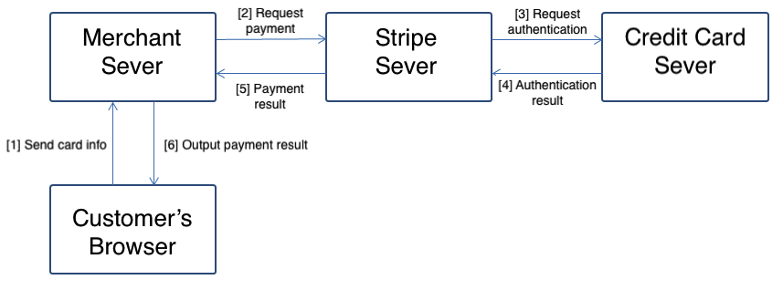
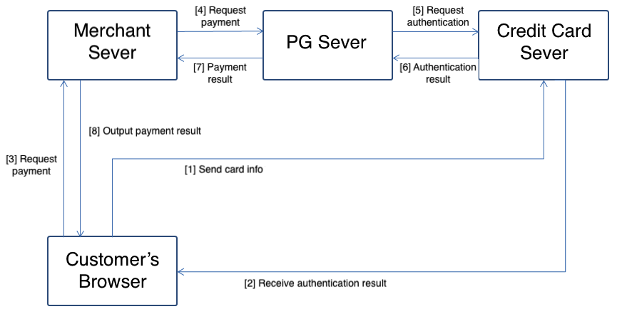
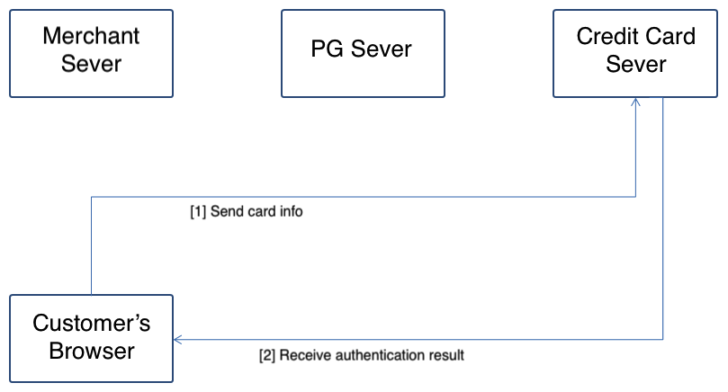
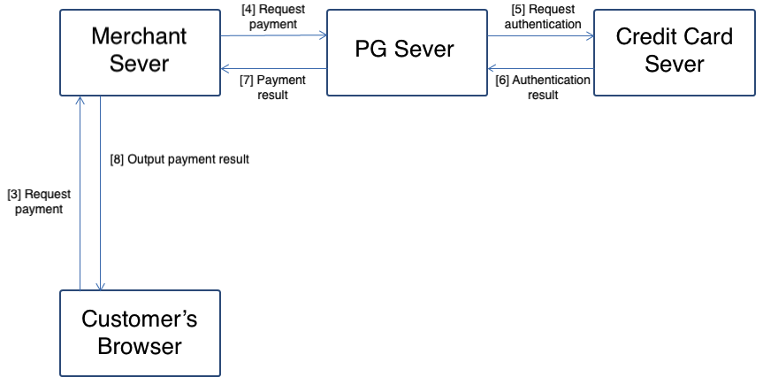
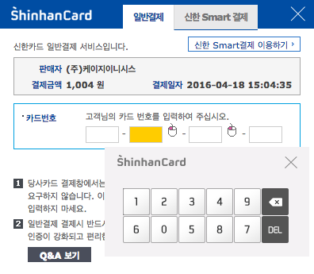
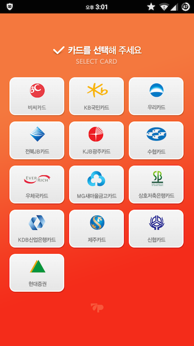

# Korean E-payment Service Flow

:globe_with_meridians: [KO](/인증결제/background.md)  

This document is intended to help you understand the technical aspects of payment service integration process. Note that it may contain some subjective opinions.  
*Even if you do not use i'mport, the following content will be helpful in understanding PG's manuals  and samples.*  

# 1. Authentication and Payment  

## Overview  

In Korea, payment processing requires that **customer's credit card information, including credit card number, expiration, and CVC**, cannot be stored on the merchant and PG servers.  

In overseas payment services, such as [Stripe](https://stripe.com/) shown in the figure below, the card information required for payment is transmitted to the card company through the merchant server and the PG (Stripe in this case) server. The payment processing flow is intuitive and easy to develop. However, the drawback is that the card information can be stored on the merchant or PG server against the aforementioned requirement posing cyber security risks.  

  
  
In Korea, except for credit card companies and select eligible PGs, card information cannot be stored on the merchant and PG servers.  

  
  
**The main difference in the above process is that the credit card company authenticates the credit card information received directly from the customer's browser**, and the payment process is performed based on the authentication result. **The merchant or PG server cannot access the credit card or personal information other than the authentication result.**  

## Authentication

  

The customer **enters card information and password** on the credit card company's payment page to confirm the validity of the credit card.  

Since credit card information and password are transmitted directly from the credit card company's payment page to its server, the merchant or PG server is technically excluded from the transmission process.  

ℹ️ The credit card company is responsible for providing https, checking for host tampering, and keyboard security to protect the transmitted credit card information, which requires additional security program installations.  

As shown in the figure below, the payment process starts by opening the PG's payment window. Since the credit card information is entered on this page, the data is sent directly to the credit card company's server without going through the PG server. <small>(The following figure shows the Shinhan Card payment page embedded in an iframe.)</small>  

  

**After the credit card information is verified, the credit card company provides the PG with a one-time authentication key that can be used to make the payment.**  

ℹ️ Note that the authentication step only checks the validity of the credit card information and does not approve the credit card for payment.

## Payment  
  

Communication for payment approval occurs directly between the **merchant server and PG server**.  
The merchant server sends information, such as the order number and customer contact information used in the authentication step, to the PG server. The PG server sends an approval request to the target credit card company using the authentication key received from the credit card company.  

This communication process determines the payment approval result (success or fail) from the credit card company. The payment approval may fail due to reasons, such as limit exceeded or lost card.  
The *authentication* will fail if the card number, expiration date, or password is incorrect.  

# 2. Secure-click, ISP, and App card  

Korean credit card companies are largely classified into two categories according to the applied authentication technology.  

- Secure-click (Shinhan / Hyundai / Hana (Forex) / Lotte / Samsung / NH)
- ISP (KB Kookmin / Woori / BC Suhyup, Jeonbuk, Gwangju, Jeju, Shinhyup, Saemaul Geumgo, etc.)

Since the same interface is used for payment module integration regardless of whether using Secure-click or ISP, the integration method is the same for both.  
**However, mobile payment module integration method varies depending on the authentication technology.**  

## Secure-click 

Secure-click authenticates credit card information through customer-entered card number, CVC, and secure-click password.  
You can enter security information, such as the credit card number and secure-click password, using the **on-screen keyboard** as shown in the figure below.  

ℹ️ In Windows, the on-screen keyboard does not appear because the program installed by the credit card company directly controls the device driver.  

  
  

Since secure-click does not require 3rd-party app integration, payment integration method is the same for both mobile web and WebView app.  

ℹ️ Android requires antivirus app installation check and URL scheme processing for the antivirus app.

## ISP  

ISP (Internet Secure Payment) authenticates credit card information that is preregistered through a public key-based electronic certificate.  
You must install a separate ISP authentication program. Once you are issued an ISP certificate for each card, you can use the certificate password without entering the card information for authentication.  

  
  

In PC web, you may not notice much difference with secure-click in terms of the UX. However, mobile payment process requires the following steps for ISP app integration:  

- Install ISP app and copy certificate to smartphone.
- Open ISP app and authenticate credit card information.
- Return to the originating payment process.

ℹ️ For Mobile app WebView integration, you must declare and handle URL scheme for returning to the originating app after switching to the ISP app.  

## App card  

For smartphone mobile payment, the credit card companies that use secure-click provide a separate authentication app that plays a similar role to the ISP of authenticating credit card information.  
By registering a credit card through identity verification and accredited certificate, you can authenticate the card just by entering a password as with ISP. Each credit card company provides its own app card, such as Hyundai, Shinhan, and Lotte app cards.  

Mobile payment process requires the following steps for app card integration:  

- Install app card.
- Open app card and authenticate credit card information.
- Return to the originating payment process.

ℹ️ For Mobile app WebView integration, you must declare and handle URL scheme for returning to the originating app after switching to the app card.  

# 3. Subscription payment  

The general payment process involves authenticating credit card and personal information from the customer using the **authentication method required by the credit card company** whenever payment is approved.  
However, there are cases where a more simplified payment process is required due to the nature of services, such as home shopping phone order, subscription, recurring, and scheduled payments.  

## 3.1 Key-in payment  

This method is used for untact shopping, mainly via phone, where payment is approved using the customer's credit card and personal information.  
(*Credit card payment through customer service or home shopping phone line*)

- Credit card number
- Credit card expiration
- Cardholder's date of birth
- First 2 digits of credit card password

Payment is approved by submitting the above information to the designated API channel. This eliminates the authentication process using accredited certificate, ISP certificate, and secure-click password.  

In addition to home shopping payments via phone, the most common usage is in the payment system of the KORAIL ticket reservation/payment app.  
 

## 3.2 Billing payment  

This payment method is used for services that require recurring/subscription payments, such as *membership fees and monthly magazine subscriptions* that are billed regularly or at a scheduled time.  

As with key-in payment, the authentication process requires the following:  

- Credit card number
- Credit card expiration
- Cardholder's date of birth
- First 2 digits of credit card password

The difference is that **billing key** is issued after the first payment approval. You can use this billing key to make any subsequent payments without providing the aforementioned information.  

 ℹ️ Since billing payment method may pose security risk to both customers and credit card companies, there are many restrictions on related merchant contracts and usage.  

## 3.3 Current Practice

According to [Credit Financial Business Act Article 16 (Liability for Credit Card Members, etc.)](http://www.law.go.kr/%EB%B2%95%EB%A0%B9/%EC%97%AC%EC%8B%A0%EC%A0%84%EB%AC%B8%EA%B8%88%EC%9C%B5%EC%97%85%EB%B2%95), **if the credit card company cannot prove that the card information or password has been leaked and used illegally due to the intentional or gross negligence of the member (customer), the credit card company cannot hold the member (customer) responsible and must provide compensation for the loss**.  

Due to such stipulation, credit card companies and PGs limit the use of simplified authentication-based payment services, such as **3.1 key-in payment** and **3.2 billing payment** to a minimum.  

ℹ️ Simplified authentication-based payment services are limited to cases where it is difficult to use the ISP or secure-click payment, such as services that require you to pay monthly or pay-as-you-go.  

In addition, online payments using ISP or secure-click may also require the customer to install a keyboard security program, check host tampering, and install an antivirus program in this context.  

Various simple payment methods are emerging, starting with Kakao Pay. With the emergence of O2O services and growing trend of *institutionalization of crowdfunding*, there is a gradual expansion of payment services to various services other than traditional e-commerce websites.

