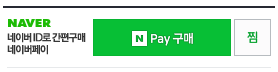

# Naver Pay (Checkout) Integration Guide

:globe_with_meridians: [KO](/NAVERPAY/sample/naverpay-order.md)  

You can integrate Naver Pay (Checkout) on the product and cart pages.

## 1. Set up PG

Use the **1) Checkout** section of the following guide to set up Naver Pay as PG in test mode:  
<a href="https://guide.iamport.kr/485c6da8-01d7-4900-bc05-76005e5477ba" target="_blank">Naver Pay (Checkout/Standard) Test Mode Configuration</a>  


## 2. Add Naver Pay button<a id="add-button"></a>

The Naver Pay pay button must be implemented using the design provided by Naver Pay SDK.  



Add the **Naver Pay button UI SDK** script to the page as follows:

```html
<!-- PC -->
<script type="text/javascript" src="https://pay.naver.com/customer/js/naverPayButton.js"></script>

<!-- Mobile -->
<script type="text/javascript" src="https://pay.naver.com/customer/js/mobile/naverPayButton.js"></script>
```
Call the `naver.NaverPayButton.apply` function to convert the specified HTML element to Naver Pay button UI element.  

Implement the button click action by defining the following button click handler properties:  

- `BUY_BUTTON_HANDLER` : **NPay** button onclick handler property
   - [Call i'mport open Naver Pay window function](#request-pay)
- `WISHLIST_BUTTON_HANDLER` : **Add to Wishlist** button onclick handler property
   - [Call i'mport Naver Pay add to wishlist function](#zzim)
  
```javascript
naver.NaverPayButton.apply({
	BUTTON_KEY: "button creation key from Naver Pay",
	TYPE: "C", //Button style
	COLOR: 1, //Button color
	COUNT: 2, //Create both NPay + Add to wishlist buttons
	ENABLE: "Y", //Enable Naver Pay (Y or N)
	EMBED_ID: "iamport-naverpay-product-button", //HTML element ID for NPay button UI element
	BUY_BUTTON_HANDLER : function() {
		//Omitted
		//Call open payment window function
		IMP.request_pay(param);
	},
	WISHLIST_BUTTON_HANDLER : function() {
		//Omitted
		//Call add to wishlist function
		IMP.naver_zzim(param);
	}
});
```

## 3. Open payment window<a id="request-pay"></a>

To open the Naver Pay window, call [IMP.request_pay(param)](https://docs.iamport.kr/en-US/tech/imp#request_pay).  

In Naver Pay, payment approval is not notified immediately, so the callback function or `m_redirect_url` of `IMP.request_pay(param)` is not called when the payment is completed. *However, the callback function is invoked when data verification fails before the payment process starts.*  

- `pg` : 
   - If not specified and this is the only PG setting that exists, `default PG` is automatically set. 
	- If there are multiple PG settings, set to `naverco`.
- `pay_method` : overwritten by the option selected in Naver Pay window.
- `buyer_tel` : Required.
- `naverCultureBenefit` : option to apply tax deductions for books/performance tickets order (true/false).
   - To enable this option, you must be registered with the Ministry of Culture, Sports and Tourism as a book/performance ticket seller and register through Naver in advance.
   - This is applied on a per order basis, so you cannot have both deductible and non-deductible products in the same order. 
- `naverInterface` : information sent to Naver Pay for funnel analysis for Naver Pay purchases.
   - If you install `//wcs.naver.net/wcslog.js` JavaScript provided by Naver for Naver Pay purchase funnel analysis, `CPAValidator`, `NA_CO`, and `NVADID` values are set automatically in the domain cookie area for buyers who entered the site through Naver search or Naver Shopping, etc. Set these values here.
- `naverProducts` : Product information represented as [Product](#product) object array (required).  
   - [naverProducts JSON Schema](naverpay-schema.md)


```javascript
IMP.request_pay({
    pg : 'naverco',
    pay_method : 'card',
    merchant_uid: '{Merchant created Order ID}', //Example: order_no_0001
    name : 'Order name: Test payment',
    amount : 14000,
    buyer_email : 'iamport@siot.do',
    buyer_name : 'Customer name',
    buyer_tel : '010-1234-5678',
    buyer_addr : 'Samseong-dong, Gangnam-gu, Seoul',
    buyer_postcode : '123-456',
    naverInterface : {
		"cpaInflowCode" : {"CPAValidator" domain cookie},
		"naverInflowCode" : {"NA_CO" domain cookie},
		"saClickId" : {"NVADID" domain cookie}
	},
    naverProducts : [
    	{
    		id : "singleProductId", //Product with no options selected
    		name : "Naver Pay Product 1",
    		basePrice : 1000,
    		taxType : 'TAX_FREE', //TAX or TAX_FREE
    		quantity : 2,
    		infoUrl : "http://www.iamport.kr/product/detail",
    		imageUrl : "http://www.iamport.kr/product/detail/thumbnail",
         giftName : "Gift A",
    		shipping : {
    			groupId : "shipping-a",
    			method : "DELIVERY", 
    			baseFee : 2500,
    			feeRule : {
    				freeByThreshold : 20000
    			},
    			feePayType : "PREPAYED" 
            },
         supplements : [
            {
               id : "supplement-a",
               name : "Add-on A",
               price : 1000,
               quantity : 1
            },
            {
               id : "supplement-b",
               name : "Add-on B",
               price : 1200,
               quantity : 2
            }
         ]
    	},
    	{
    		id : "optionProductId", //Product with options selected
    		name : "Naver Pay Product 2",
    		basePrice : 1000,
    		taxType : 'TAX_FREE', //TAX or TAX_FREE
    		infoUrl : "http://www.iamport.kr/product/detail",
    		imageUrl : "http://www.iamport.kr/product/detail/thumbnail",
         giftName : "Gift B",
    		options : [ // Total purchase of 5 items (3 in red-170mm and 2 in red-180mm)
    			{
    				optionQuantity : 3,
    				optionPrice : 100,
    				selectionCode : "R_M",
    				selections : [
    					{
	      				code : "RED",
	  						label : "Color",
	  						value : "Red"
	  					},
	  					{
	  						code : "170",
	  						label : "Size",
	  						value : "170"
	  					}
					]
				},
    			{
    				optionQuantity : 2,
    				optionPrice : 200,
    				selectionCode : "R_L",
    				selections : [
    					{
	      				code : "RED",
	  						label : "Color",
	  						value : "Red"
	  					},
	  					{
	  						code : "180",
	  						label : "Size",
	  						value : "180"
	  					}
					]
				}
			],
			shipping : {
				groupId : "shipping-a",
				method : "DELIVERY", 
				baseFee : 2500,
				feeRule : {
    				freeByThreshold : 20000
    			},
				feePayType : "PREPAYED" 
			}
		}
	]
}, function(rsp) {
    if ( !rsp.success ) {
    	//When an error occurs before payment process starts
        var msg = 'An error occurred before initiating payment.';
        msg += 'Error: ' + rsp.error_msg;

        alert(msg);
    }
});
```

### Product object of `naverProducts` array<a id="product"></a>

Specifies product details and following additional information.  

- `options` (object array): information about one or more options selected for the product.
- `supplements` (object array): information about one or more add-ons selected for the product.
- `shipping` (object): shipping policy to apply.  

```javascript
{
	"id" : "Shoe_ax82a",   //Product ID
	"merchantProductId" : "Shoe_ax82a", //Product management ID (set if needed, default value: id)
	"ecMallProductId" : "Shoe_ax82a",   //Knowledge shopping product management ID (set if needed, default value: id)
	"name" : "Shoes", //Product name
	"basePrice" : 1000, //Product price
	"taxType" : "TAX",       //Option to tax (TAX or TAX_FREE)
	"quantity" : 2,  //Purchase quantity
	"infoUrl" : "http://www.iamport.kr/product/detail",    //Product page URL
	"imageUrl" : "http://www.iamport.kr/product/detail/thumbnail",   //Product thumbnail image URL
   "giftName" : "Gift A", //Gift that comes with the product, if any
	"options" : "array(of option)",     //Details about selected options
   "supplements" : "array(of supplement)", //Details about selected add-ons
	"shipping" : "object(of shipping)"    //Shipping details
}
```

### Option object of `options` array<a id="option"></a>

Specifies details for **selected options**. The following is an example of selecting RED color and 180mm size.  

```javascript
{
	optionQuantity : 2,     //Quantity selected for the product with the specified options 
	optionPrice : 200,      //Amount added for the selected options. This is added to the Product.basePrice and can be negative (-).
	selectionCode : "R_L",     //Code for the selected option combination. In this example, R_L code is defined for REDx180 option
	selections : [             //Selected options
		{
			code : "RED",       //Option code
			label : "Color",      //Option label
			value : "Red"       //Option value
		},
		{
			code : "180",
			label : "Size",
			value : "180"
		}
	]
}
```

### Supplement object of `supplements` array<a id="supplement"></a>

Specifies details for selected add-on.    

```javascript
{
    id : "supplement-a",    //Add-on ID
    name : "Add-on A",    //Add-on name
    price : 1000,           //Add-on price
    quantity : 1            //Add-on quantity
}
```


### `shipping` object<a id="shipping"></a>

Specifies the shipping policy for the product. For more information, refer to [Naver Pay shipping policy and examples](naverpay-shipping.md).  

- Ship all products in the order together: Set the same `shipping.groupId` to all Product objects in `naverProducts`.
- Ship each product separately: Set a different `shipping.groupId` or a blank ("") value for all Product objects in `naverProducts`. *Shipping charges for each product are summed together.*  

```javascript
{
	groupId : "GroupFopOrder",  //Shipping group ID. Products with the same groupId are shipped together.
	method : "DELIVERY", //DELIVERY (Courier Delivery/Parcel/Registered), QUICK_SVC (Quick Service), DIRECT_DELIVERY (Direct Delivery), VISIT_RECEIPT (Private Pick-up), NOTHING (No Delivery)
	baseFee : 2500,  //Base shipping rate
	feeRule : {
		freeByThreshold : 20000
	},
	feePayType : "PREPAYED" //PREPAYED or CASH_ON_DELIVERY
}
```


## 4. Naver Pay's product verification  
 
When you click the **Pay** button at the bottom of the Naver Pay payment window, the Naver Pay server sends an HTTP GET request to the URL registered by the merchant in Naver Pay to verify the products in the order and available inventory.  

The merchant server must provide an appropriate response (XML) to the GET request from the Naver Pay server to verify that the products in the order are available for purchase and complete the payment process.  

If the information in the XML response is insufficient, incorrect, or does not match the requested product information (‘naverProducts’), the following pop-up is displayed and the payment process is terminated.  


  
## 4.1 Product verification request  

Naver Pay verifies product information by sending an HTTP GET request to the merchant. The product information required for verification is sent as query strings as for the following two types of products:  

- Product with no options selected :  
    - product[0][id] : singleProductId (`Product.id` value)
- Product with options selected : 
    - product[1][id] : optionProductId (`Product.id` value)
    - product[1][optionManageCode] : R_L(`Product.option.selectionCode` value)

```
http://{URL registered in Naver Pay}?product[0][id]=singleProductId&product[1][id]=optionProductId&product[1][optionManageCodes]=R_L
```


## 4.2 XML response<a id="xml-response"></a>

For additional information, refer to [Request/Response Examples for Naver Pay Product Options and Add-ons](naverpay-validation.md).  

```xml
<?xml version="1.0" encoding="UTF-8"?>
<products>
	<!-- Details for product with no options selected -->
	<product>
      <id>singleProductId</id>
      <name>상품singleProduct</name>
      <basePrice>1000</basePrice>
      <taxType />
      <infoUrl>http://www.iamport.kr/product/detail</infoUrl>
      <imageUrl>http://www.iamport.kr/product/detail/thumbnail</imageUrl>
      <giftName>Gift A</giftName>
      <status>ON_SALE</status>
      <shippingPolicy>
         <groupId />
         <method>DELIVERY</method>
         <feeType>FREE</feeType>
         <feePayType>FREE</feePayType>
         <feePrice>0</feePrice>
      </shippingPolicy>
   </product>

   <!-- Details for product with options selected --> -->
   <product>
      <id>optionProductId</id>
      <name>상품optionProduct</name>
      <basePrice>1000</basePrice>
      <taxType />
      <infoUrl>http://www.iamport.kr/product/detail</infoUrl>
      <imageUrl>http://www.iamport.kr/product/detail/thumbnail</imageUrl>
      <giftName>Gift B</giftName>
      <status>ON_SALE</status>
      <shippingPolicy>
         <groupId />
         <method>DELIVERY</method>
         <feeType>FREE</feeType>
         <feePayType>FREE</feePayType>
         <feePrice>0</feePrice>
      </shippingPolicy>
      <optionSupport>true</optionSupport> <!-- Required for option-selected product -->
      <option>
      	  <!-- Define all available options for the product -->
         <optionItem>
            <type>SELECT</type>
            <name>색상</name>
            <value>
               <id>RED</id>
               <text>Red</text>
            </value>
            <value>
               <id>BLUE</id>
               <text>Blue</text>
            </value>
         </optionItem>
         <optionItem>
            <type>SELECT</type>
            <name>Size</name>
            <value>
               <id>160</id>
               <text>160</text>
            </value>
            <value>
               <id>170</id>
               <text>170</text>
            </value>
            <value>
               <id>180</id>
               <text>180</text>
            </value>
         </optionItem>

         <!-- If there are 2 or more option types (optionItem), define all possible option combinations -->
         <!-- If there is only one option type (optionItem) but price varies by option, define all options to specify different price for each option -->
         <combination>
            <manageCode>R_S</manageCode>
            <options>
               <name>Color</name>
               <id>RED</id>
            </options>
            <options>
               <name>Size</name>
               <id>160</id>
            </options>
         </combination>
         <combination>
            <manageCode>R_M</manageCode>
            <price>100</price>
            <options>
               <name>Color</name>
               <id>RED</id>
            </options>
            <options>
               <name>Size</name>
               <id>170</id>
            </options>
         </combination>
         <combination>
            <manageCode>R_L</manageCode>
            <price>200</price>
            <options>
               <name>Color</name>
               <id>RED</id>
            </options>
            <options>
               <name>Size</name>
               <id>180</id>
            </options>
         </combination>
         <!-- ...Omitted (Define combinations for BLUE as for RED)... -->
      </option>
   </product>
</products>
```


## 5. Synchronize order information   

Since the payment completion is not notified immediately for Naver Pay (Checkout), the i'mport server synchronizes the order status by periodically checking the payment change history.  

### Payment process flow  
1. Open Naver Pay window and request payment (`unpaid`)
2. Payment process complete (`success`)
3. i'mport batch server checks for payment completion every minute
4. **Change the payment status of i'mport transaction to `paid` and synchronize order information**
5. Notify payment completion via notification URL

### Synchronize order information

In Naver Pay, unlike other PG payment methods, buyer information, shipping address, and shipping cost are entered and finalized in the payment step.   

#### Example

When the Naver Pay window is called as follows, payment information is first recorded in the payment approval history page of the [i'mport Admin Console](https://admin.iamport.kr/payments) as follows. *The following parameters can be changed in the payment step.*  

- amount : 14000
- buyer_email : 'iamport@siot.do'
- buyer_name : 'Customer name'
- buyer_tel : '010-1234-5678'
- buyer_addr : 'Samseong-dong, Gangnam-gu, Seoul'
- buyer_postcode : '123-456'
  
Based on the product shipping information entered by the customer in the payment step, the payment information is changed as follows. You can check the changed information in the payment approval history page of the [i'mport Admin Console](https://admin.iamport.kr/payments) or via API.  

- amount : 14000 -> 18500
- buyer_addr : "Samseong-dong, Gangnam-gu, Seoul" -> "123, Cheomdan-ro, Jeju-si"

```javascript
IMP.request_pay({
    pg : 'naverco',
    pay_method : 'card',
    merchant_uid: '{Merchant created Order ID}', // Example: order_no_0001
    name : 'Order name: Test payment',
    amount : 14000,
    buyer_email : 'iamport@siot.do',
    buyer_name : 'Customer name',
    buyer_tel : '010-1234-5678', // Required
    buyer_addr : 'Samseong-dong, Gangnam-gu, Seoul',
    buyer_postcode : '123-456',
    naverProducts : [
    	{
    		id : "singleProductId",
    		name : "Naver Pay Product 1",
    		basePrice : 14000,
    		taxType : 'TAX_FREE', //TAX or TAX_FREE
    		quantity : 1,
    		infoUrl : "http://www.iamport.kr/product/detail",
    		imageUrl : "http://www.iamport.kr/product/detail/thumbnail",
         giftName : "Gift A",
    		shipping : {
    			groupId : "shipping-a",
    			method : "DELIVERY", 
    			baseFee : 2500,
    			feeRule : {
    				surchargesByArea : [ //array or string(API)
    					{area:"island", surcharge:2000},
    					{area:"jeju", surcharge:4500}
    				]
    			},
    			feePayType : "PREPAYED" 
    		}
    	}
	]
});
``` 


## 6. Add to wishlist<a id="zzim"></a>  
 
In the Naver Pay [Add to Wishlist](#add-button) onclick handler, the i'mport JavaScript function is called to send the target product information to Naver Pay as follows: (Supported from iamport.payment-1.1.6.js)  

Set the Product ID (`naverProduducts.id`) to the same Product ID (`naverProduducts.id`) specified for purchasing the product.  

```javascript
IMP.naver_zzim({
  naverProducts: [
    {
      "id" : "Product ID",
      "name" : "Product name",
      "desc" : "Product details",
      "uprice" : 10000, //Product price
      "url" : "http://www.yourshop.com/product/123", //Product URL
      "thumb" : "http://www.yourshop.com/product/123/thumbnail", //Product thumbnail image
      "image" : "http://www.yourshop.com/product/123/image" //Product image URL
    },
    {
      "id" : "Product ID",
      "name" : "Product name",
      "desc" : "Product details",
      "uprice" : 10000, //Product price
      "url" : "http://www.yourshop.com/product/123", //Product URL
      "thumb" : "http://www.yourshop.com/product/123/thumbnail", //Product thumbnail image
      "image" : "http://www.yourshop.com/product/123/image" //Product image URL
    }
  ]
});
```
