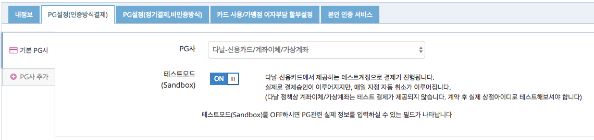

# 다날-신용카드 빌링키 발급
빌링키 발급을 위해 카드사에 카드정보를 전달할 때, 다날-신용카드의 결제창을 통해 직접 PG사로 전달하는 방식만 제공합니다.  
(`/subscribe/customers/{customer_uid}` API 및 `/subscribe/payments/onetime`를 사용할 수 없음)


## 1. PG설정  
다날-신용카드 빌링키 결제창을 통해 빌링키 발급이 진행되어야 하므로 아임포트 관리자 페이지의 시스템 설정 > PG설정(인증방식결제)에서 설정합니다.  



- 다날-신용카드/계좌이체/가상계좌 선택
- Sandbox를 On으로 변경


## 2. 빌링키 발급을 위한 결제창 호출
인증방식의 결제를 위해 `iamport.payment.js`의 `IMP.request_pay(param, callback)` 와 동일한 인터페이스를 사용합니다.  
*(다날 결제모듈은 PC와 모바일의 차이점이 없으므로 아래의 코드를 PC/모바일에서 모두 사용 가능합니다.)*  

### 2.1 빌링키 발급만 진행하는 경우(amount : 0)  
amount는 0으로 지정하더라도, 다날 측에서 최초 10원을 테스트 성격으로 결제를 했다가 30분 쯤 후 자동 취소하게 됩니다. 

```javascript
IMP.request_pay({
	pay_method : 'card', // 'card'만 지원됩니다.
	merchant_uid : 'merchant_' + new Date().getTime(),
	name : '최초인증결제',
	amount : 0, // 빌링키 발급만 진행하며 결제승인을 하지 않습니다.
	customer_uid : 'your-customer-unique-id', //customer_uid 파라메터가 있어야 빌링키 발급을 시도합니다.
	buyer_email : 'iamport@siot.do',
	buyer_name : '아임포트',
	buyer_tel : '02-1234-1234'
}, function(rsp) {
	if ( rsp.success ) {
		alert('빌링키 발급 성공');
	} else {
		alert('빌링키 발급 실패');
	}
});
```

### 2.2 빌링키 발급 & 최초 결제를 동시에 진행하는 경우(amount : 가격지정)  
다날 측에서 별도로 테스트결제(10원)를 수행하지 않으며, 실제 구매자로부터 지정된 금액을 결제받음과 동시에 빌링키 발급을 진행합니다.  

```javascript
IMP.request_pay({
	pay_method : 'card', // 'card'만 지원됩니다.
	merchant_uid : 'merchant_' + new Date().getTime(),
	name : '최초인증결제',
	amount : 1004, // 빌링키 발급과 동시에 1,004원 결제승인을 시도합니다.
	customer_uid : 'your-customer-unique-id', //customer_uid 파라메터가 있어야 빌링키 발급을 시도합니다.
	buyer_email : 'iamport@siot.do',
	buyer_name : '아임포트',
	buyer_tel : '02-1234-1234'
}, function(rsp) {
	if ( rsp.success ) {
		alert('빌링키 발급 성공');
	} else {
		alert('빌링키 발급 실패');
	}
});
```


## 3. 발급된 빌링키로 결제요청  
빌링키 발급이 성공적으로 이루어지면, 전달된 `customer_uid` 와 1:1 매칭되어 아임포트에 보관됩니다.
때문에, `customer_uid`를 전달하면 발급된 빌링키를 찾아 결제승인 요청을 진행하게 됩니다.

```
curl -H "Content-Type: application/json" \   
     -X POST -d '{"customer_uid":"your-customer-unique-id", "merchant_uid":"order_id_8237352", "amount":3000}' \
     https://api.iamport.kr/subscribe/payments/again
```