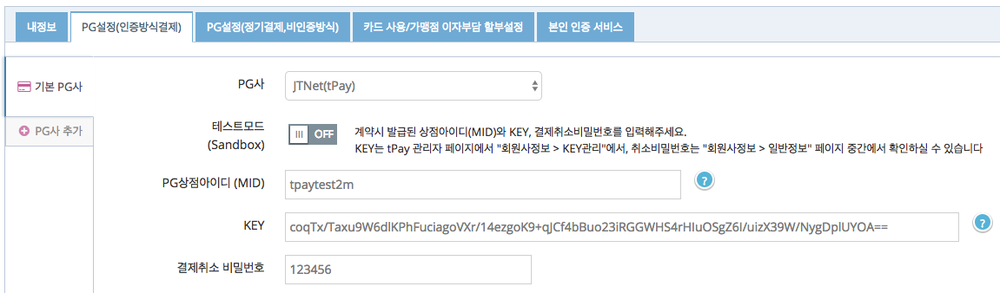

# JTNet 정기결제(빌링) 연동 가이드 `결제창`

JTNet의 웹표준 결제창/모바일 결제창을 통해서 빌링키 발급과 최초 결제를 같이 요청하거나, 빌링키 발급을 요청하여 발급받은 빌링키로 결제를 요청할 수 있습니다.

ℹ️ 자세한 내용은 [일반결제창으로 정기결제 연동하기](https://docs.iamport.kr/implementation/subscription?lang=ko#issue-billing-b)를 참고하세요.

ℹ️ 키인결제 REST API를 사용하여 일회성 결제를 연동할 수 있습니다. 해당 내용은 [JTNet 정기결제(빌링) 연동 가이드 (REST API 방식)](/비인증결제/example/jtnet-api-billing-key.md)을 참고하세요.

## 1. PG 설정하기

1. [아임포트 관리자 콘솔 > 시스템 설정 > PG설정(일반결제 및 정기결제)](https://admin.iamport.kr/settings#tab_pg) 탭으로 이동합니다.
1. 기본 PG사 탭 또는 **PG사 추가**를 누르면 나타나는 추가 PG사 탭의 **PG사**에 `JTNet(tPay)`를 선택합니다.
1. **테스트모드(Sandbox)** 옵션을 `OFF`로 설정합니다.
1. <b>PG상점아이디 (MID)</b>에 `tpaytest2m`를 입력합니다.
1. **KEY**에 `coqTx/Taxu9W6dlKPhFuciagoVXr/14ezgoK9+qJCf4bBuo23iRGGWHS4rHIuOSgZ6I/uizX39W/NygDplUYOA==`를 입력합니다.
1. **결제취소 비밀번호**에 `123456`를 입력합니다.
1. 하단에 **전체 저장** 버튼을 눌러 설정을 저장합니다.



## 2. 빌링키 발급 요청하기

[IMP.request_pay(param, callback)](https://docs.iamport.kr/tech/imp#request_pay)을 호출하여 빌링키 발급을 위한 결제창을 호출합니다.

ℹ️ 자세한 내용은 [일반결제창으로 빌링키 요청하기](https://docs.iamport.kr/implementation/subscription#issue-billing-b)를 참고하세요.

PC의 경우 `IMP.request_pay(param, callback)` 호출 후 callback으로 실행되고, 모바일의 경우 `m_redirect_url`로 리디렉션됩니다.

- `pg` : 등록된 PG사가 하나일 경우에는 미 설정시 `기본 PG사`가 자동으로 적용되며, 여러개인 경우에는 `jtnet`으로 지정합니다.
- `customer_uid` : 빌링키 등록을 위해서 지정해야 합니다.
- `amount` : 빌링키 발급만 하는 경우 "0"으로 지정하고, 빌링키 발급과 최초 결제를 같이 요청하는 경우 가격을 지정합니다.  

### 2.1 빌링키 발급만 요청하기(amount : 0)  

```javascript
IMP.request_pay({
	pay_method : 'card', // 'card'만 지원됩니다.
	merchant_uid : 'merchant_' + new Date().getTime(),
	name : '최초인증결제',
	amount : 0, // 빌링키 발급만 진행하며 결제승인을 하지 않습니다.
	customer_uid : 'your-customer-unique-id', // 필수 입력.
	buyer_email : 'iamport@siot.do',
	buyer_name : '아임포트',
	buyer_tel : '02-1234-1234',
	m_redirect_url : '{결제 완료 후 리디렉션 될 URL}' // 예: https://www.my-service.com/payments/complete/mobile
}, function(rsp) {
	if ( rsp.success ) {
		alert('빌링키 발급 성공');
	} else {
		alert('빌링키 발급 실패');
	}
});
```

### 2.2 빌링키 발급 및 최초 결제 요청하기(amount : 가격지정)  

```javascript
IMP.request_pay({
	pay_method : 'card', // 'card'만 지원됩니다.
	merchant_uid : 'merchant_' + new Date().getTime(),
	name : '최초인증결제',
	amount : 1004, // 빌링키 발급과 함께 1,004원 결제승인을 시도합니다.
	customer_uid : 'your-customer-unique-id', // 필수 입력.
	buyer_email : 'iamport@siot.do',
	buyer_name : '아임포트',
	buyer_tel : '02-1234-1234'
}, function(rsp) {
	if ( rsp.success ) {
		alert('빌링키 발급 성공');
	} else {
		alert('빌링키 발급 실패');
	}
});
```

## 3. 빌링키로 결제 요청하기

빌링키 발급이 성공하면 빌링키는 전달된 `customer_uid` 와 1:1 매칭되어 아임포트에 저장됩니다. 보안상의 이유로 서버는 빌링키에 직접 접근할 수 없기 때문에 `customer_uid`를 이용해서 재결제([POST /subscribe/payments/again](https://api.iamport.kr/#!/subscribe/again)) REST API를 다음과 같이 호출합니다.

```
curl -H "Content-Type: application/json" \   
     -X POST -d '{"customer_uid":"your-customer-unique-id", "merchant_uid":"order_id_8237352", "amount":3000}' \
     https://api.iamport.kr/subscribe/payments/again
```