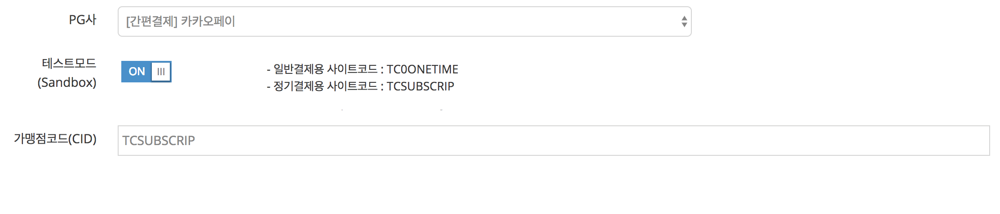

# 카카오페이 빌링키 발급 및 빌링결제요청  
카카오페이에 등록된 신용카드 또는 카카오머니로 진행되며 빌링 최초 결제는 카카오페이 최초 결제와 유사합니다. 카카오톡 앱 내에서 카카오머니 또는 카드 선택 후 최초 결제 및 빌링키 발급이 진행됩니다.    
(`/subscribe/payments/onetime`, `/subscribe/customers/{customer_uid}` API를 사용할 수 없음)


## 1. PG설정  
## 1.1 테스트모드 설정  


1. PG사 : [간편결제] 카카오페이 선택 후, 테스트모드 설정 ON상태로 둡니다.
2. 가맹점코드(CID)에는, `TCSUBSCRIP` 를 입력합니다.

## 1.2 상용모드 설정  

1. [아임포트 PG가입 페이지](http://www.iamport.kr)에서 카카오페이 가입 신청을 합니다.
2. PG사 : [간편결제] 카카오페이 선택 후, 테스트모드 설정 OFF상태로 둡니다.
3. 가맹점코드(CID)에는, 계약 후 발급받은 CID 를 입력합니다. (정기결제가 가능한 CID를 발급받으셔야 합니다)


## 2. 일반 신용카드 결제와 빌링키 발급 결제의 차이  

`IMP.request_pay(param, callback)` 호출시 `param.customer_uid` 파라메터의 유무로 일반신용카드 결제와 빌링키 결제를 구분합니다.
최초 결제 시 카카오머니를 선택하면 재결제에도 카카오머니로 결제가 되며, 최초 결제 시 신용카드를 선택하면 재결제에도 신용카드로 결제가 됩니다.

## 3. 빌링키 발급을 위한 결제창 호출
인증방식의 결제를 위해 `iamport.payment.js`의 `IMP.request_pay(param, callback)` 와 동일한 인터페이스를 사용합니다.  
*(파라메터 등의 정보는 [인증결제](https://github.com/iamport/iamport-manual/tree/master/%EC%9D%B8%EC%A6%9D%EA%B2%B0%EC%A0%9C) 매뉴얼 또는 [카카오페이 일반결제 예시](../../%EC%9D%B8%EC%A6%9D%EA%B2%B0%EC%A0%9C/sample/kakao.md) 내용을 참고해주세요.)*  

### 3.1 빌링키 발급만 진행하는 경우(amount : 0)  

```javascript
IMP.request_pay({
	merchant_uid : 'merchant_' + new Date().getTime(),
	name : '최초인증결제',
	amount : 0, // 빌링키 발급만 진행하며 결제승인을 하지 않습니다.
	customer_uid : 'your-customer-unique-id', //customer_uid 파라메터가 있어야 빌링키 발급이 정상적으로 이뤄집니다.
	buyer_email : 'iamport@siot.do',
	buyer_name : '아임포트',
	buyer_tel : '02-1234-1234'
}, function(rsp) {
	if ( rsp.success ) {
		alert('빌링키 발급 성공');
	} else {
		alert('빌링키 발급 실패');
	}
});
```

### 3.2 빌링키 발급 & 최초 결제를 동시에 진행하는 경우(amount : 가격지정)  

```javascript
IMP.request_pay({
	pay_method : 'card', // 결제창 호출단계에서의 pay_method 는 아무런 역할을 하지 못하며, 구매자가 카카오페이 앱 내에서 신용카드 vs 카카오머니 중 실제 선택한 값으로 추후 정정됩니다.
	merchant_uid : 'merchant_' + new Date().getTime(),
	name : '최초인증결제',
	amount : 1004, // 빌링키 발급과 동시에 1,004원 결제승인을 시도합니다.
	customer_uid : 'your-customer-unique-id', //customer_uid 파라메터가 있어야 빌링키 발급이 정상적으로 이뤄집니다.
	buyer_email : 'iamport@siot.do',
	buyer_name : '아임포트',
	buyer_tel : '02-1234-1234'
}, function(rsp) {
	if ( rsp.success ) {
		alert('빌링키 발급 성공');
	} else {
		alert('빌링키 발급 실패');
	}
});
```


## 4. 발급된 빌링키로 결제요청  
빌링키 발급이 성공적으로 이루어지면, 전달된 `customer_uid` 와 1:1 매칭되어 아임포트에 보관됩니다.  
때문에, `customer_uid`를 전달하면 발급된 빌링키를 찾아 결제승인 요청을 진행하게 됩니다.  

재결제시 결제 금액은 최초 결제 금액과 달라도 결제승인에 문제없습니다. (단, 월별 최대 횟수 제한됨)

```
curl -H "Content-Type: application/json" \   
     -X POST -d '{"customer_uid":"your-customer-unique-id", "merchant_uid":"order_id_8237352", "amount":3000}' \
     https://api.iamport.kr/subscribe/payments/again
```

보다 상세한 API 스펙은 [https://api.iamport.kr/#!/subscribe/again](https://api.iamport.kr/#!/subscribe/again) 를 참고하시면 됩니다.  
