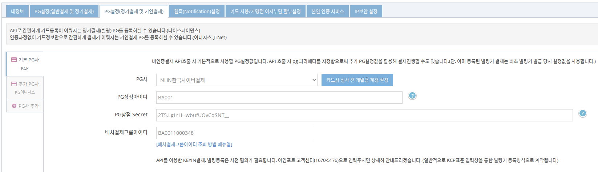

# NHN KCP 정기결제(빌링) 연동 가이드 `REST API`

KCP와 별도 협의된 가맹점은 키인결제([POST /subscribe/payments/onetime](https://api.iamport.kr/#!/subscribe/onetime))와 빌링키 발급([POST /subscribe/customers/{customer_uid}](https://api.iamport.kr/#!/subscribe.customer/customer_save)) REST API를 사용할 수 있습니다.

ℹ️ 자세한 내용은 [REST API 방식으로 정기결제 연동하기](https://docs.iamport.kr/implementation/subscription?lang=ko#issue-billing-b)를 참고하세요.


ℹ️ 결제창을 통한 정기결제(빌링) 연동에 대한 내용은 [KCP 정기결제(빌링) 연동 가이드 (결제창 방식)](/비인증결제/example/kcp-request-billing-key.md)을 참고하세요.

## 1. PG 설정하기

1. [아임포트 관리자 콘솔 > 시스템 설정 > PG설정(정기결제 및 키인결제)](https://admin.iamport.kr/settings#tab_sbcr) 탭으로 이동합니다.
1. 기본 PG사 탭 또는 **PG사 추가**를 누르면 나타나는 추가 PG사 탭의 **PG사**에 `NHN한국사이버결제`를 선택합니다.
1. **카드사 심사 전 개발용 계정 설정** 버튼을 누르면 개발 계정 정보가 자동으로 입력됩니다.
1. 하단에 **저장** 버튼을 눌러 설정을 저장합니다.

  


## 2. 일회성 결제 요청하기

REST API [POST /subscribe/payments/onetime](https://api.iamport.kr/#!/subscribe/onetime)을 호출하여 일회성 결제를 요청합니다. 요청 시 전달된 카드는 아임포트에 등록되지 않습니다.

```
curl -H "Content-Type: application/json" \   
     -X POST -d '{"merchant_uid":"order_id_8237352", "card_number":"1234-1234-1234-1234", "expiry":"2019-01", "birth":"123456", "amount":3000}' \
     https://api.iamport.kr/subscribe/payments/onetime
```      
## 3. 빌링키 발급 요청하기

REST API [POST /subscribe/customers/{customer_uid}](https://api.iamport.kr/#!/subscribe.customer/customer_save)를 호출하여 빌링키 발급을 요청합니다.

```
curl -H "Content-Type: application/json" \   
     -X POST -d '{"card_number":"1234-1234-1234-1234", "expiry":"2025-12", "birth":"820213", "pwd_2digit":"00"}' \
     https://api.iamport.kr/subscribe/customers/your-customer-unique-id
```

## 4. 빌링키 발급 및 최초 결제 요청하기  

REST API [POST /subscribe/payments/onetime](https://api.iamport.kr/#!/subscribe/onetime)을 호출하여 빌링키 발급과 최초 결제를 같이 요청합니다.

- `customer_uid` : 빌링키 등록을 위해서 지정해야 합니다.

```
curl -H "Content-Type: application/json" \   
     -X POST -d '{"customer_uid":"your-customer-unique-id", "merchant_uid":"order_id_8237352", "card_number":"1234-1234-1234-1234", "expiry":"2019-01", "birth":"123456", "amount":3000, "pwd_2digit":"00"}' \
     https://api.iamport.kr/subscribe/payments/onetime
```

## 5. 빌링키로 결제 요청하기  

빌링키 발급이 성공하면 빌링키는 전달된 `customer_uid` 와 1:1 매칭되어 아임포트에 저장됩니다. 보안상의 이유로 서버는 빌링키에 직접 접근할 수 없기 때문에 `customer_uid`를 이용해서 재결제([POST /subscribe/payments/again](https://api.iamport.kr/#!/subscribe/again)) REST API를 다음과 같이 호출합니다.

```
curl -H "Content-Type: application/json" \   
     -X POST -d '{"customer_uid":"your-customer-unique-id", "merchant_uid":"order_id_8237352", "amount":3000}' \
     https://api.iamport.kr/subscribe/payments/again
```