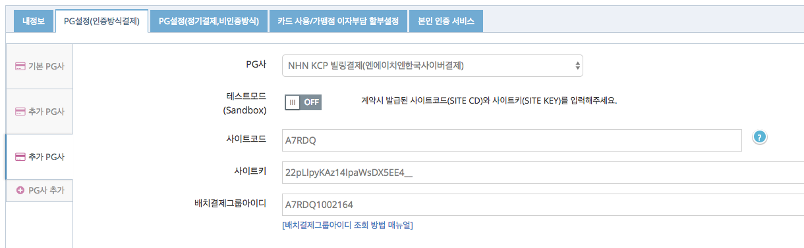

# KCP 빌링키 발급
빌링키 발급을 위해 카드사에 카드정보를 전달할 때, KCP의 웹표준 결제창/모바일 결제창을 통해 직접 PG사로 전달하는 방식만 제공합니다.  
(`/subscribe/payments/onetime`, `/subscribe/customers/{customer_uid}` API를 사용할 수 없음)


## 1. PG설정  
KCP 웹표준 결제창을 통해 빌링키 발급이 진행되어야 하므로 아임포트 관리자 페이지의 시스템 설정 > PG설정(인증방식결제)에서 설정합니다.  


- KCP 빌링결제 선택  
- Sandbox를 Off로 변경  
- 사이트코드에 KCP에서 발급받으신 사이트코드 입력  
- 사이트키에 KCP에서 발급받으신 사이트키 입력  
- 배치결제그룹아이디는 [설정 매뉴얼](http://www.iamport.kr/download/kcp-billing.pdf)에 따라 생성 후 입력  

`param.customer_uid`를 지정하셔서 KCP일반결제와 같이 결제창 호출하시면 KCP 빌링결제창이 나타납니다.   
KCP일반결제와 마찬가지로 PC의 경우 `IMP.request_pay(param, callback)`호출 후 callback으로 실행되나 모바일의 경우 `m_redirect_url`로 리디렉션됩니다.  

## 2. 빌링키 발급을 위한 결제창 호출
인증방식의 결제를 위해 `iamport.payment.js`의 `IMP.request_pay(param, callback)` 와 동일한 인터페이스를 사용합니다.  
*(파라메터 등의 정보는 [인증결제](https://github.com/iamport/iamport-manual/tree/master/%EC%9D%B8%EC%A6%9D%EA%B2%B0%EC%A0%9C) 매뉴얼 내용을 참고해주세요.)*  

**amount필드는 결제창에 금액표시용으로만 사용되며 실제 해당 금액으로 승인이 이뤄지지는 않습니다. 빌링키 발급과 동시에 결제를 진행하려면 amount 필드에 금액 파라메터를 전달하여 결제창에 결제될 금액이 표시되도록하고 빌링키 발급과 동시에 `/subscribe/payments/again` API를 호출하여 결제승인처리를 하면 구매자로하여금 혼선이 없습니다.**  


### 빌링키 발급 결제창 호출  

```javascript
IMP.request_pay({
   pg : 'kcp_billing', //KCP일반결제는 kcp이며, KCP빌링결제는 kcp_billing 으로 구분됩니다.
	pay_method : 'card', // 'card'만 지원됩니다.
	merchant_uid : 'merchant_' + new Date().getTime(),
	name : '최초인증결제',
	amount : 0, // 결제창에 표시될 금액. 실제 승인이 이뤄지지는 않습니다. (PC에서는 가격이 표시되지 않음)
	customer_uid : 'your-customer-unique-id', //customer_uid 파라메터가 있어야 빌링키 발급을 시도합니다.
	buyer_email : 'iamport@siot.do',
	buyer_name : '아임포트',
	buyer_tel : '02-1234-1234'
}, function(rsp) {
	if ( rsp.success ) {
		alert('빌링키 발급 성공');
	} else {
		alert('빌링키 발급 실패');
	}
});
```


## 3. 발급된 빌링키로 결제요청  
빌링키 발급이 성공적으로 이루어지면, 전달된 `customer_uid` 와 1:1 매칭되어 아임포트에 보관됩니다.  
때문에, `customer_uid`를 전달하면 발급된 빌링키를 찾아 결제승인 요청을 진행하게 됩니다.  

```
curl -H "Content-Type: application/json" \   
     -X POST -d '{"customer_uid":"your-customer-unique-id", "merchant_uid":"order_id_8237352", "amount":3000}' \
     https://api.iamport.kr/subscribe/payments/again
```