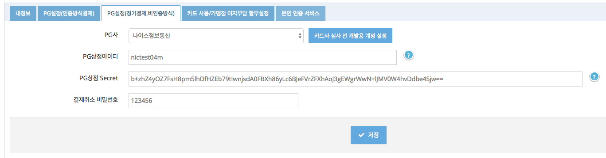

# 나이스정보통신 빌링키 발급
빌링키 발급을 위해 카드사에 카드정보를 전달할 때, 아임포트의 REST API를 통해 PG사로 전달하는 방식만 제공합니다.  
(javascript 사용할 필요 없음)


## 1. PG설정  
아임포트 REST API를 통해 빌링키 발급이 진행되어야 하므로 아임포트 관리자 페이지의 시스템 설정 > PG설정(정기결제,비인증방식)에서 설정합니다.  



PG사 선택하신 후 "카드사 심사 전 개발용 계정 설정"버튼을 누르면 개발 계정이 자동 입력되면 "저장"버튼을 누릅니다.  


## 2. 빌링키 발급을 위한 REST API  

### 2.1 결제와 동시에 빌링키 발급을 하려는 경우    
아래 예시에는 필수 파라메터만 기재되어있으며, 보다 상세한 파라메터 내용은 [https://api.iamport.kr](https://api.iamport.kr/#!/subscribe/onetime) 에서 확인하실 수 있습니다.  

```
curl -H "Content-Type: application/json" \   
     -X POST -d '{"customer_uid":"your-customer-unique-id", "merchant_uid":"order_id_8237352", "amount":3000, "card_number":"1234-1234-1234-1234", "expiry":"2019-01", "birth":"801231", "pwd_2digit":"00"}' \
     https://api.iamport.kr/subscribe/payments/onetime
```

### 2.2 빌링키 발급만 진행하려는 경우  
아래 예시에는 필수 파라메터만 기재되어있으며, 보다 상세한 파라메터 내용은 [https://api.iamport.kr](https://api.iamport.kr/#!/subscribe.customer/customer_save) 에서 확인하실 수 있습니다.  

```
curl -H "Content-Type: application/json" \   
     -X POST -d '{"card_number":"1234-1234-1234-1234", "expiry":"2019-01", "birth":"801231", "pwd_2digit":"00"}' \
     https://api.iamport.kr/subscribe/customers/your-customer-unique-id
```


## 3. 발급된 빌링키로 결제요청  
빌링키 발급이 성공적으로 이루어지면, 전달된 `customer_uid` 와 1:1 매칭되어 아임포트에 보관됩니다.
때문에, `customer_uid`를 전달하면 발급된 빌링키를 찾아 결제승인 요청을 진행하게 됩니다.

```
curl -H "Content-Type: application/json" \   
     -X POST -d '{"customer_uid":"your-customer-unique-id", "merchant_uid":"order_id_8237352", "amount":3000}' \
     https://api.iamport.kr/subscribe/payments/again
```