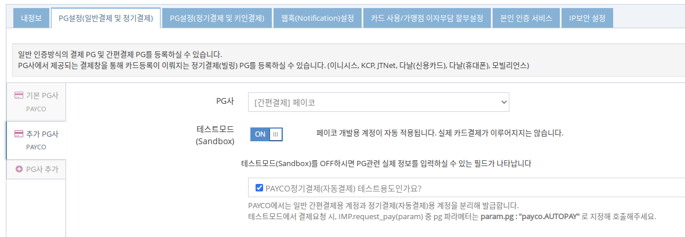

# PAYCO 정기결제(자동결제) 구현  

PAYCO 간편결제에 등록돼있는 신용카드 중, 정기결제(자동결제)에 사용될 신용카드를 먼저 지정합니다. 이 과정은 PAYCO결제창을 통해 진행되므로 아임포트 JavaScript SDK를 활용해 진행됩니다. (`/subscribe/payments/onetime`, `/subscribe/customers/{customer_uid}` API를 사용할 수 없음)  
등록이 된 후에는, 서비스에 결제가 필요한 시점(예시 : 매월 주기적으로, 서비스 종료된 직후 등)에 API 요청을 통해서 실제 사용자를 대신해 결제승인을 처리하게 됩니다. 

## 1. PG설정  
아임포트 관리자 페이지의 시스템 설정 > PG설정(인증방식결제)에서 PAYCO-간편결제를 선택한 후 테스트모드 ON 상태에서 "PAYCO정기결제(자동결제) 테스트용도인가요?" 체크박스 체크 후 저장합니다.  
실제 계약 후 상용계정을 받급받으시면 테스트모드 OFF후 CPID, ProductID, SellerKey를 입력하시면 됩니다.



## 2. 빌링키 발급(자동결제 등록)을 위한 PAYCO 결제창 호출
PAYCO 일반 간편결제와 마찬가지로 `iamport.payment-1.1.8.js`의 `IMP.request_pay(param, callback)` 를 호출합니다.  
유일한 차이점은, `customer_uid` 파라메터의 존재유무입니다. 

- `customer_uid` 가 정의됨 : 정기결제(자동결제) 등록 모드로 동작
- `customer_uid` 가 정의되지 않거나 빈 값 : 일반 간편결제 모드로 동작


정기결제 등록 요청 시, **amount필드는 결제창에 금액표시용으로만 사용되며 실제 해당 금액으로 승인이 이뤄지지는 않습니다. 빌링키 발급과 동시에 결제를 진행하려면 amount 필드에 금액 파라메터를 전달하여 결제창에 결제될 금액이 표시되도록하고 빌링키 발급과 동시에 `/subscribe/payments/again` API를 호출하여 결제승인처리를 하면 구매자로하여금 혼선이 없습니다.**  


### 빌링키 발급(자동결제 등록) 결제창 호출  

```javascript
IMP.request_pay({
    pg : 'payco', 
	pay_method : 'card', //파라메터가 영향을 미치지 않습니다.
	merchant_uid : 'merchant_' + new Date().getTime(),
	name : 'PAYCO 자동결제 등록',
	amount : 1000, // 결제창에 표시될 금액. 실제 승인이 이뤄지지는 않습니다.
	customer_uid : 'your-customer-unique-id', //customer_uid 파라메터가 있어야 빌링키 발급(자동결제 등록)모드로 동작합니다.
	buyer_email : 'iamport@siot.do',
	buyer_name : '아임포트',
	buyer_tel : '02-1234-1234'
}, function(rsp) {
	if ( rsp.success ) {
		alert('빌링키 발급(자동결제 등록) 성공');
	} else {
		alert('빌링키 발급(자동결제 등록) 실패');
	}
});
```

## 3. 발급된 빌링키(등록된 자동결제)로 결제요청  
빌링키 발급(자동결제 등록)이 성공적으로 이루어지면, 전달된 `customer_uid` 와 1:1 매칭되어 아임포트에 보관됩니다.  
때문에, `customer_uid`를 전달하면 발급된 빌링키를 찾아 결제승인 요청을 진행하게 됩니다.  

```
curl -H "Content-Type: application/json" \   
     -X POST -d '{"customer_uid":"your-customer-unique-id", "merchant_uid":"order_id_8237352", "amount":3000}' \
     https://api.iamport.kr/subscribe/payments/again
```