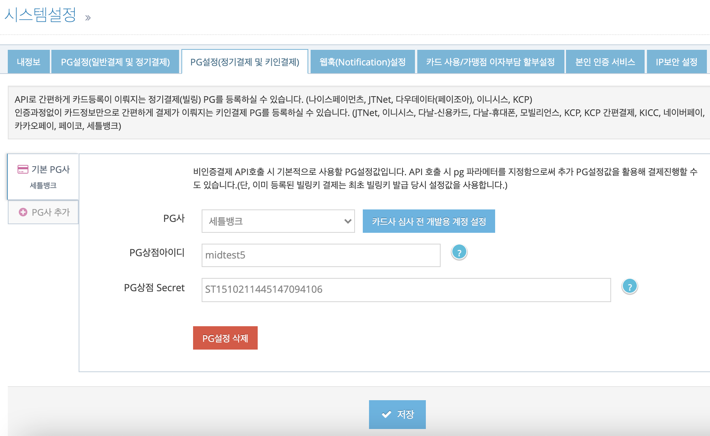

# 세틀뱅크 비인증 결제 연동 가이드

세틀뱅크는 아임포트 키인결제 REST API [/subscribe/payments/onetime](https://api.iamport.kr/#!/subscribe/onetime)를 사용하여 일회성 결제를 요청하거나 빌링키 발급과 최초 결제를 같이 요청할 수 있습니다. REST API `/subscribe/customers/{customer_uid}`를 사용하여 **별도로 빌링키 발급을 요청 할 수 없습니다**.
<Br />

자세한 내용은 다음의 정기결제 연동 가이드를 참고하세요.

- [REST API로 정기결제 연동하기](https://docs.iamport.kr/implementation/subscription?lang=ko#issue-billing-a)

## 1. PG 설정하기  

1. [아임포트 관리자 콘솔 > 시스템 설정 > PG설정(정기결제 및 키인결제)](https://admin.iamport.kr/settings#tab_sbcr) 탭으로 이동합니다.
1. **PG사 추가**를 누르면 나타나는 PG설정 탭의 **PG사**에 `세틀뱅크`를 선택합니다.
1. **카드사 심사 전 개발용 계정 설정** 버튼을 누르면 개발 계정 정보가 자동으로 입력됩니다.
1. **저장** 버튼을 눌러 설정을 저장합니다.




## 2. 일회성 결제 요청하기

REST API [/subscribe/payments/onetime](https://api.iamport.kr/#!/subscribe/onetime)을 호출하여 일회성 결제를 요청합니다. 요청 시 전달된 카드는 아임포트에 등록되지 않습니다.

```
curl -H "Content-Type: application/json" \   
     -X POST -d '{"merchant_uid":"order_id_8237352", "card_number":"1234-1234-1234-1234", "expiry":"2019-01", "birth":"123456", "amount":3000}' \
     https://api.iamport.kr/subscribe/payments/onetime
```


## 3. 빌링키 발급 및 최초 결제 요청하기  

REST API [/subscribe/payments/onetime](https://api.iamport.kr/#!/subscribe/onetime)을 호출하여 빌링키 발급과 최초 결제를 요청합니다.

- `customer_uid` : 졍기 결제를 위한 카드 등록을 위해서 지정해야 합니다. 
- `birth` : 세틀뱅크 계약상 생년월일 6자리가 요건일 경우에 입력합니다. 계약상 요건이 아닐 경우에는 dummy 값(*123456*)을 지정합니다.

```
curl -H "Content-Type: application/json" \   
     -X POST -d '{"customer_uid":"your-customer-unique-id", "merchant_uid":"order_id_8237352", "card_number":"1234-1234-1234-1234", "expiry":"2019-01", "birth":"123456", "amount":3000}' \
     https://api.iamport.kr/subscribe/payments/onetime
```


## 4. 빌링키로 결제 요청하기

빌링키 발급과 최초 결제가 성공하면 빌링키는 전달된 `customer_uid` 와 1:1 매칭되어 아임포트에 저장됩니다. 보안상의 이유로 서버는 빌링키에 직접 접근할 수 없기 때문에 `customer_uid`를 이용해서 다음과 같이 결제 요청을 합니다.

```
curl -H "Content-Type: application/json" \   
     -X POST -d '{"customer_uid":"your-customer-unique-id", "merchant_uid":"order_id_8237352", "amount":3000}' \
     https://api.iamport.kr/subscribe/payments/again
