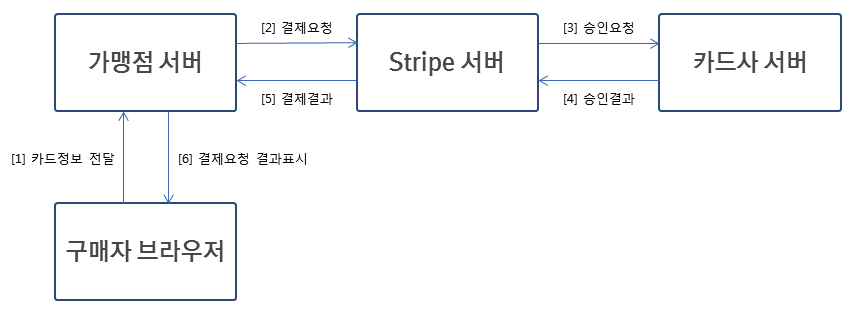
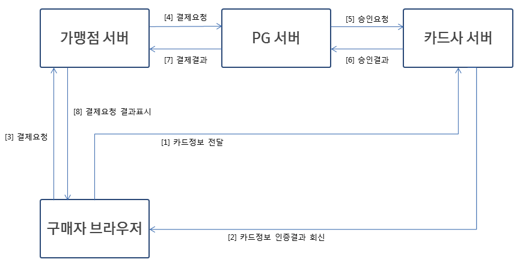
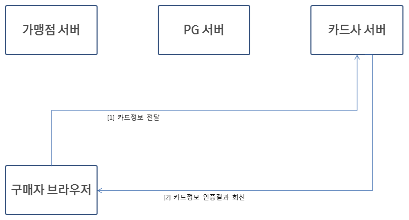
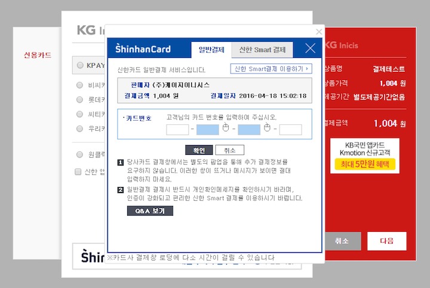
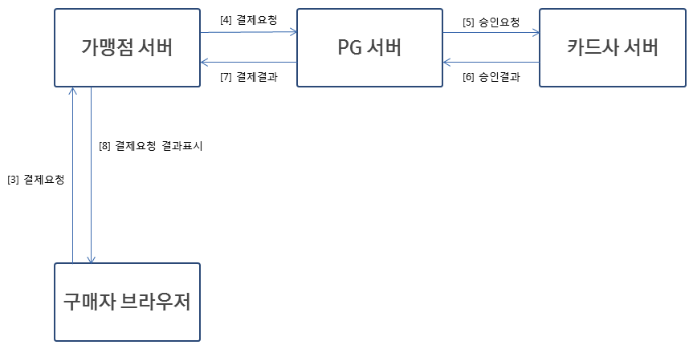
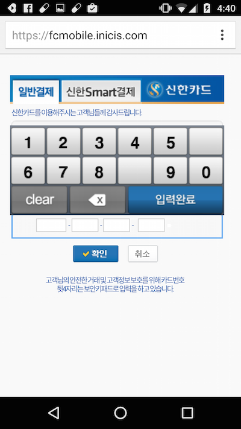
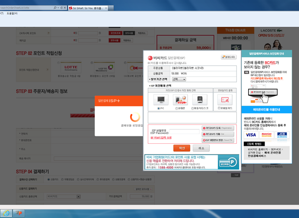
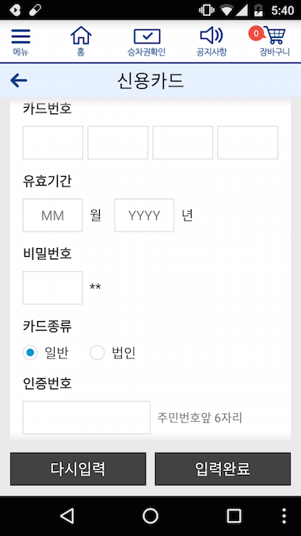

# 한국 전자결제 서비스 흐름

:globe_with_meridians: [EN](/en/General/background.md)  

본 섹션은 결제서비스 연동과정에 대한 기술적 이해도를 높이고자 기술적 측면, 시장상황 등 사실 관계를 바탕으로 작성했습니다. 편의상 아임포트의 주관적 의견이 일부 포함하고 있음을 미리 밝힙니다.  
(*아임포트를 사용하지 않더라도 다음의 내용을 통해 PG사의 매뉴얼/샘플을 이해하시는데 보다 도움될 것으로 생각됩니다*)  

#1. 인증과 결제(한국 결제의 특징)
## 목적 
**카드정보(카드번호 / 유효기간 / CVC등)를 가맹점 또는 PG사에서 저장할 수 없도록**, 결제프로세스를 구성한다고 생각해보겠습니다. 

[Stripe](https://stripe.com/)와 같은 해외 서비스의 경우,  
  

와 같이 결제에 필요한 카드정보가 가맹점 서버, PG사(위 경우에는 Stripe)서버를 거쳐 카드사에 전달이 되는 구조이므로 구성이 직관적이고 결제처리에 대한 개발이 단순합니다.  
하지만, 중간 과정에서 마음만 먹으면 가맹점 서버, PG사 서버에 카드정보를 저장할 수 있어 목적에 부합하지 못합니다. 

한국에서는 카드사, 일부 PG사(적격PG로 선정된 곳)를 제외하고는 카드정보를 저장할 수 없도록 규정되어있기 때문에 카드정보가 가맹점서버, PG사 서버를 직접 거쳐가지 않도록 다음과 같이 구성할 수 있습니다.  

  

**카드사 서버가 구매자 브라우저로부터 직접 카드정보를 전달받아 인증처리해주는 부분**이 가장 큰 차이이며, 인증된 결과를 바탕으로 결제프로세스가 진행되기 때문에 **가맹점 서버나 PG사 서버는 카드사로부터 전달되는 인증결과정보 외에는 카드정보나 개인정보에 접근할 수 없습니다.**  

## 인증
  
구매자는 **카드사가 제공하는 웹페이지에서 카드정보, 비밀번호 등을 입력**하여 결제하려는 카드가 존재하는 카드인지, 카드 소지자가 맞는지 확인하게 됩니다.  

구매자의 브라우저에서 카드사가 제공하는 웹페이지를 통해 직접 카드사 서버로 카드정보, 비밀번호 등을 전달하기 때문에 가맹점 또는 PG사는 기술적으로 카드정보 전달 과정에서 배제됩니다.  
<small>(*카드사는 웹페이지를 통해 전달받는 카드정보의 보호를 위해 https제공, 호스트 변조확인, 키보드 보안을 책임지게 되며 이 과정에서 별도의 프로그램 설치가 요구됩니다.*)</small>  

아래 그림과 같이, 결제프로세스가 시작되면 PG사에서 제공하는 결제창이 나타나는데 (카드사 선택 후 진행하면) 카드사가 제공하는 웹페이지가 나타나게 됩니다. 이 웹페이지 내에서 실제 카드정보를 입력하게 되므로 카드정보는 PG사를 거치지 않고 카드사로 직접 전송됩니다.<small>(예시 화면에서는 신한카드가 제공하는 웹페이지가 iframe형태로 출력되고 있습니다)</small>  

  

**카드정보에 대한 확인이 완료되면 카드사는 1회성 인증키를 PG사에 제공하며, 이 인증키가 실제 결제에 사용됩니다.**  
(*인증 단계에서는 카드정보의 유효성 확인만 이뤄질 뿐 카드승인이 이루어지지 않습니다.*)  

## 결제 
  
결제를 위한 통신은 **가맹점 서버와 PG사 서버간**에 직접 이루어지게 됩니다.  
가맹점 서버는 인증단계에서 사용된 주문번호, 구매자 연락처 등의 정보를 PG사 서버로 전송하게 되며 PG사는 카드사로부터 전달된 인증키와 함께 해당 카드사로 승인요청을 진행하게 됩니다.  

이 통신 과정에서 실제 카드사로부터 결제승인에 대한 결과가 판단되며, 성공적으로 결제승인이 이뤄지거나 한도초과/분실카드 등의 사유로 결제승인에 실패할 수 있습니다.  
카드번호 / 유효기간 / 비밀번호가 틀리게 되면 "인증 단계"에서 실패가 되고 한도초과 / 분실카드일 경우에는 "인증" 단계는 통과하지만 "결제" 단계에서 실패가 됩니다.  

#2. 안심클릭과 ISP, 그리고 앱카드
"인증"단계에서 카드정보를 인증하는 기술적 방식에 따라 국내 카드사들은 크게 2가지로 분류됩니다.  

- 안심클릭 계열 (신한 / 현대 / 하나(외환) / 롯데 / 삼성 / NH )
- ISP 계열 ( KB국민 / 우리 / BC수협, 전북, 광주, 제주, 신협, 새마을금고 등 )

PC에서의 결제모듈 연동은 안심클릭/ISP계열과 무관하게 동일한 인터페이스로 이뤄지기 때문에 따로 구분하여 알아두실 필요가 없습니다만,  
**모바일에서의 결제모듈 연동은 안심클릭/ISP계열에 따라 연동 방식의 차이**가 있어 구분하여 알아두실 필요가 있습니다.  

## 안심클릭 계열 
카드번호, CVC, 안심클릭 비밀번호를 입력하여 카드정보를 인증하는 방식입니다.  
다음과 같은 **"그림 키보드"**를 통해 카드번호, 안심클릭 비밀번호 등 보안정보를 입력하는 것이 특징입니다.  
<small>(*Windows 환경에서는 카드사에서 설치하는 프로그램이 직접 디바이스 드라이브를 제어하기 때문에 그림 키보드가 나타나지 않습니다*)</small>  

  
  

안심클릭 계열의 카드사에 대한 결제연동 방식은 별도의 외부 앱을 필요로하지 않기 때문에 

- 모바일 브라우저
- WebView 앱결제 

에 있어 결제처리가 동일하다는 특징이 있습니다.  
<small>(단, 안드로이드 단말에서는 백신앱 설치여부를 확인하는 과정이 있어 백신앱에 대한 URL scheme처리가 일부 필요합니다.)</small>

## ISP 계열
ISP(Internet Secure Payment)는 공개키기반의 전자인증서를 통해 사전에 등록된 카드정보를 인증하는 방식입니다.  
ISP인증을 위한 별도의 프로그램 설치가 필요하며 카드별로 ISP인증서 발급 후 비밀번호를 입력하면 카드정보를 입력할 필요가 없습니다.  

  
  

PC결제 상황에서는 안심클릭과 UX가 별다른 차이를 못느끼실 수 있습니다만, **모바일 결제에서는 스마트폰에 ISP앱 설치/인증서복사를 요구하며 설치된 ISP앱으로 이동하여 카드정보 인증 절차를 거치고 다시 원래 결제프로세스로 돌아온다**는 큰 차이점이 있습니다.(안심클릭은 별도의 앱으로 이동할 필요가 없음)  

이로 인해, 안심클릭 계열의 카드사와 달리

- 모바일 브라우저
- WebView 앱결제 

에 있어 결제처리가 차이가 있습니다.  
(WebView 앱결제에 있어서 ISP앱으로 빠져나가 인증을 하고, 다시 앱으로 돌아오기 위해 URL scheme정의/처리가 필요합니다)  

## 앱카드
스마트폰 모바일 결제에 한하여, 안심클릭 계열의 카드사들이 ISP와 유사한 역할을 하는 인증용 앱을 별도로 운영하고 이 앱을 통해 카드정보를 인증하도록 제공하고 있습니다.  
본인확인, 공인인증서를 통해 카드 등록이 이뤄지면 ISP와 마찬가지로 비밀번호 입력만으로 카드정보 인증이 이뤄질 수 있다는 장점을 가지고 있으며 각 카드사별로 각각의 앱카드 앱을 운영하고 있습니다(*예시. 현대앱카드, 신한앱카드, 롯데앱카드 등*)  

ISP와 마찬가지로 카드정보 인증을 위해 외부 앱으로 빠져나갔다가 돌아온다는 점에서,

- 모바일 브라우저
- WebView 앱결제 

에 있어 결제처리가 차이가 있습니다.  
(ISP와 마찬가지로 WebView 앱결제에 있어서 앱카드 앱으로 빠져나가 인증을 하고, 다시 앱으로 돌아오기 위해 URL scheme정의/처리가 필요합니다)  

# 3. 비인증결제
우리가 일반적으로 경험하는 결제프로세스는 앞서 설명한 것처럼 결제 승인이 될 때마다 **카드사가 일반적으로 요구하는 인증 방식에 따라** 카드정보 + 개인정보를 사용자로부터 직접 확인하는 방식입니다.  
하지만 홈쇼핑 전화주문, 정기결제, 예약결제 등 서비스 특성상 보다 간소화된 결제프로세스가 필요한 경우들이 있습니다. 

## 3.1 key-in 결제
주로 전화를 통한 비대면 상황에서 카드정보 + 개인정보를 활용해 결제승인이 일어나는 방식입니다.  
(*홈쇼핑, 고객센터 상담원을 통한 카드 결제*)

- 카드번호 
- 유효기간
- 카드 소지자 생년월일
- 카드 비밀번호 앞 2자리 

4가지 정보를 지정된 API채널로 전달함으로써 결제승인이 이뤄지는 방식이며 공인인증서, ISP인증서, 안심클릭비밀번호 등을 활용한 인증과정이 생략됩니다.  

전화를 통한 홈쇼핑 결제 외에 가장 흔히 찾아볼 수 있는 예로는 코레일 승차권 예약/결제 앱의 결제시스템입니다.  

## 3.2 빌링 결제
1회성 결제가 아니라 정기적으로 결제가 반복되어야 하는 서비스에 활용됩니다. (*매월 정해진 날짜에 결제가 되는 서비스 이용료/간행물 결제 등*)  

- 카드번호 
- 유효기간
- 카드 소지자 생년월일
- 카드 비밀번호 앞 2자리 

를 활용하여 일반적인 인증 절차를 생략하는 것은 key-in 결제와 동일합니다.  

차이점은, 결제승인이 이뤄진 후 **빌링키**가 발급이 되는데 2회차 결제승인부터는 **빌링키**를 사용하면 위 4가지 정보가 없어도 결제승인이 가능하다는 점입니다. *(그만큼 카드사, 이용자 입장에서 예민할 수 밖에 없는 결제방식이라 가맹점 계약 및 이용에 제약이 많습니다.)*  

## 3.3 현실
[여신금융업법 16조(신용카드회원등에 대한 책임)](http://www.law.go.kr/%EB%B2%95%EB%A0%B9/%EC%97%AC%EC%8B%A0%EC%A0%84%EB%AC%B8%EA%B8%88%EC%9C%B5%EC%97%85%EB%B2%95)에 따르면 **회원(구매자)의 고의 또는 중과실로 카드정보 또는 비밀번호가 유출되어 부정사용된 것을 카드사가 입증해내지 못하면 신용카드사는 회원(구매자)에게 책임을 지울 수 없으며 보상처리를 하도록 규정**되어있습니다.  

때문에, 카드사와 PG사는 **3.1 key-in 결제**, **3.2 빌링 결제**와 같이 간소화된 인증방식의 결제 서비스 사용을 최소한으로 제한하고 있는 것이 현실입니다.  
(*매월 정기적으로 결제가 필요한 경우, 서비스 사용량에 따라 사후에 과금금액이 결정되는 경우 등 ISP/안심클릭 방식의 결제로 서비스가 어려운 경우로 한정하고 있습니다*)

또한, ISP/안심클릭 방식의 온라인 결제에서도 키보드 보안 프로그램 설치, 호스트 변조 확인, 백신 프로그램 설치 등을 구매자에게 요구하는 것은 이와 같은 맥락에서 생각해볼 수 있겠습니다.  

카카오페이를 시작으로 다양한 간편결제방식의 서비스들이 대두되고 있고 O2O서비스의 등장, "크라우드 펀딩 제도화"추세에 따라 전통적인 커머스 사이트 외 다양한 서비스에서 결제서비스 이용이 가능하도록 조금씩 확대되는 분위기로 생각됩니다.  

