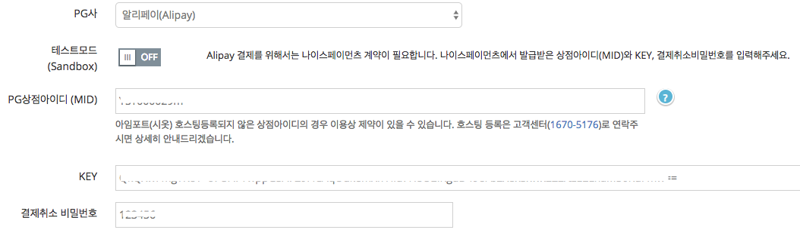

# 1. PG 설정  

> 알리페이(Alipay) 결제 서비스 제공을 위해서는 국내 대행사인 "나이스페이먼츠"와 계약이 필요합니다.   
> USD 화폐단위가 기본 제공되며 KRW 추가 사용을 위해서는 "나이스페이먼츠"와 사전 논의가 필요합니다.

## 1.1 테스트모드 설정  


1. PG사 : 알리페이(Alipay) 선택 후, 테스트모드 설정 ON상태로 둡니다. 

## 1.2 상용모드 설정  



1. [아임포트 PG가입 페이지](http://www.iamport.kr)에서 "나이스페이먼츠" 가입 신청을 합니다. 
2. PG사 : 알리페이(Alipay) 선택 후, 테스트모드 설정 OFF상태로 둡니다. 
3. 상점아이디(MID), KEY, 결제취소비밀번호에 계약 후 발급받은 정보를 입력합니다. (KEY, 결제취소비밀번호는 나이스페이먼츠 상점관리자 로그인 후 확인 가능)


# 2. PC, 모바일 브라우저 연동  


알리페이 보안정책상 페이지 리디렉션 방식으로 결제가 진행되므로 PC / 모바일 모두 `m_redirect_url` 파라메터를 사용해 결제 후 랜딩될 URL을 지정해야 합니다. 

**페이지 리디렉션 방식이기 때문에 결제완료 후 `IMP.request_pay(param, callback)`의 callback 함수를 활용할 수 없습니다.**  

- 알리페이를 특정하는 `pg` 코드는 `alipay` 입니다. 알리페이를 "기본PG사"로 하나만 사용하시는 경우에는 `pg`파라메터는 생략이 가능합니다. 
- `pay_method`파라메터는 생략가능하며 아무값이나 무방합니다.  
- `currency` 파라메터는 생략되면 `USD` 기본값으로 적용됩니다. (USD / KRW 2개만 지원)


```javascript
IMP.request_pay({
    pg : 'alipay',
    pay_method : 'card',
    merchant_uid : 'merchant_' + new Date().getTime(),
    name : '주문명:결제테스트',
    amount : 1.2, //USD 1.2 달러 결제
    buyer_email : 'iamport@siot.do',
    buyer_name : '구매자이름',
    buyer_tel : '010-1234-5678',
    buyer_addr : '서울특별시 강남구 삼성동',
    buyer_postcode : '123-456',
    m_redirect_url : "https://shop.yourservice.com/payments/complete"
});
```

## 2.1 서버단에서 결제완료여부 파악하기  

PC, 모바일 결제 모두 결제가 끝나면, 브라우저는 `m_redirect_url`로 리디렉션 됩니다. (302디리렉션에 의한 HTTP GET요청)  
위 예제와 같이 `m_redirect_url : 'https://shop.yourservice.com/payments/complete'` 파라메터 지정하면 실제 GET요청은 다음과 같습니다. 

```
GET https://shop.yourservice.com/payments/complete?imp_uid={아임포트 거래고유번호}&merchant_uid={가맹점 주문번호}&imp_success=true
```

GET요청의 Query 파라메터로 전달되는 `imp_uid` 값을 이용해 서버단에서 아임포트 REST API 호출 후 결제완료 여부를 정확히 판단하여야 합니다.  

- GET https://api.iamport.kr/payments/{아임포트 거래고유번호} API 호출
- response.status === 'paid' 인지 체크
- response.amount === {결제받아야 할 금액} 인지 체크

보다 자세한 내용은 아임포트 개발문서의 [서버에서 거래 검증 및 데이터 동기화](https://docs.iamport.kr/implementation/payment#server-side-logic) 섹션을 참고부탁드립니다.  