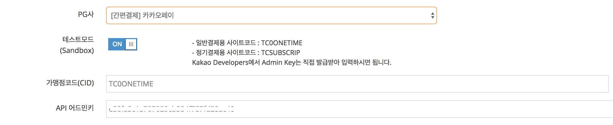

# 1. PG 설정  

> 2018년 5월부로 (주)LGCNS가 운영하던 카카오페이는 종료되며, (주) 카카오페이가 운영하는 카카오페이로 전환됩니다. LGCNS 사용자가 카카오페이 이관이 이뤄질 수 있도록 당분간 병행할 예정입니다. 
> 
> 코드는 모두 동일하나, pg\_provider 파라메터가 서로 다르니 주의바랍니다. 
> 
> 기존 카카오페이 - pg\_provider : kakao  
> 신규 카카오페이 - pg\_provider : kakaopay 
> 
> 기존 카카오페이(LGCNS)사용자가 신규 카카오페이로 모두 이관할 때까지 두 방식은 병행하여 운영됩니다. 

## 1.1 테스트모드 설정  


1. PG사 : [간편결제] 카카오페이 선택 후, 테스트모드 설정 ON상태로 둡니다. 
2. 가맹점코드(CID)에는, `TC0ONETIME` 를 입력합니다. 

## 1.2 상용모드 설정  

1. [아임포트 PG가입 페이지](http://www.iamport.kr)에서 카카오페이 가입 신청을 합니다. 
2. PG사 : [간편결제] 카카오페이 선택 후, 테스트모드 설정 OFF상태로 둡니다. 
3. 가맹점코드(CID)에는, 계약 후 발급받은 CID 를 입력합니다. 


# 2. PC, 모바일 브라우저 연동  


카카오페이의 경우 제공되는 결제창을 활용했을 때 서비스의 기본 페이지로부터 이동을 할 필요가 없어 PC, 모바일 브라우저 환경에서 동일한 소스코드를 적용할 수 있습니다.  

페이지 이동이 없기 때문에 `IMP.request_pay(param, callback)`의 callback 함수를 활용할 수 있습니다.  

- 카카오페이를 "기본PG사"로 하나만 사용하시는 경우에는 `pg`파라메터는 생략이 가능합니다. 
- `pay_method`파라메터는 생략가능하며 아무값이나 무방합니다. (신용카드 / 카카오머니 2가지 결제수단이 카카오톡 앱 내에서 결정되며 해당되는 결제수단으로 `pay_method` 가 변경됩니다.)  


```javascript
IMP.request_pay({
    pg : 'kakaopay',
    pay_method : 'card',
    merchant_uid : 'merchant_' + new Date().getTime(),
    name : '주문명:결제테스트',
    amount : 14000,
    buyer_email : 'iamport@siot.do',
    buyer_name : '구매자이름',
    buyer_tel : '010-1234-5678',
    buyer_addr : '서울특별시 강남구 삼성동',
    buyer_postcode : '123-456'
}, function(rsp) {
    if ( rsp.success ) {
    	//[1] 서버단에서 결제정보 조회를 위해 jQuery ajax로 imp_uid 전달하기
    	jQuery.ajax({
    		url: "/payments/complete", //cross-domain error가 발생하지 않도록 주의해주세요
    		type: 'POST',
    		dataType: 'json',
    		data: {
	    		imp_uid : rsp.imp_uid
	    		//기타 필요한 데이터가 있으면 추가 전달
    		}
    	}).done(function(data) {
    		//[2] 서버에서 REST API로 결제정보확인 및 서비스루틴이 정상적인 경우
    		if ( everythings_fine ) {
    			var msg = '결제가 완료되었습니다.';
    			msg += '\n고유ID : ' + rsp.imp_uid;
    			msg += '\n상점 거래ID : ' + rsp.merchant_uid;
    			msg += '\결제 금액 : ' + rsp.paid_amount;
    			msg += '카드 승인번호 : ' + rsp.apply_num;
    			
    			alert(msg);
    		} else {
    			//[3] 아직 제대로 결제가 되지 않았습니다.
    			//[4] 결제된 금액이 요청한 금액과 달라 결제를 자동취소처리하였습니다.
    		}
    	});
    } else {
        var msg = '결제에 실패하였습니다.';
        msg += '에러내용 : ' + rsp.error_msg;
        
        alert(msg);
    }
});
```  