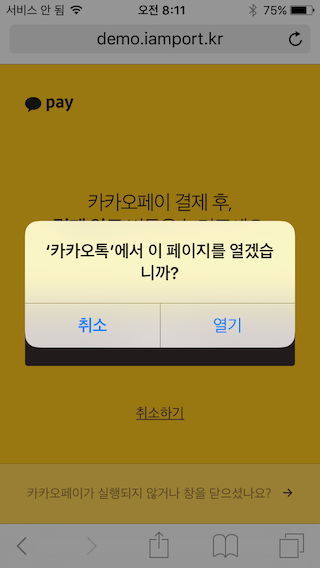

#1. PC, 모바일 브라우저 연동  


카카오페이의 경우 제공되는 결제창을 활용했을 때 서비스의 기본 페이지로부터 이동을 할 필요가 없어 PC, 모바일 브라우저 환경에서 동일한 소스코드를 적용할 수 있습니다.  

페이지 이동이 없기 때문에 `IMP.request_pay(param, callback)`의 callback 함수를 활용할 수 있습니다.  

- 카카오페이를 "기본PG사"로 하나만 사용하시는 경우에는 `pg`파라메터는 생략이 가능합니다. 
- `pay_method`파라메터는 `card`를 사용하셔야 합니다. (아임포트 내부적으로 kakao는 PG사 명칭으로 판단하며, 카카오페이는 카드결제만 지원합니다)  


```javascript
IMP.request_pay({
    pg : 'kakao',
    pay_method : 'card',
    merchant_uid : 'merchant_' + new Date().getTime(),
    name : '주문명:결제테스트',
    amount : 14000,
    buyer_email : 'iamport@siot.do',
    buyer_name : '구매자이름',
    buyer_tel : '010-1234-5678',
    buyer_addr : '서울특별시 강남구 삼성동',
    buyer_postcode : '123-456',
    kakaoOpenApp : true
}, function(rsp) {
    if ( rsp.success ) {
    	//[1] 서버단에서 결제정보 조회를 위해 jQuery ajax로 imp_uid 전달하기
    	jQuery.ajax({
    		url: "/payments/complete", //cross-domain error가 발생하지 않도록 주의해주세요
    		type: 'POST',
    		dataType: 'json',
    		data: {
	    		imp_uid : rsp.imp_uid
	    		//기타 필요한 데이터가 있으면 추가 전달
    		}
    	}).done(function(data) {
    		//[2] 서버에서 REST API로 결제정보확인 및 서비스루틴이 정상적인 경우
    		if ( everythings_fine ) {
    			var msg = '결제가 완료되었습니다.';
    			msg += '\n고유ID : ' + rsp.imp_uid;
    			msg += '\n상점 거래ID : ' + rsp.merchant_uid;
    			msg += '\결제 금액 : ' + rsp.paid_amount;
    			msg += '카드 승인번호 : ' + rsp.apply_num;
    			
    			alert(msg);
    		} else {
    			//[3] 아직 제대로 결제가 되지 않았습니다.
    			//[4] 결제된 금액이 요청한 금액과 달라 결제를 자동취소처리하였습니다.
    		}
    	});
    } else {
        var msg = '결제에 실패하였습니다.';
        msg += '에러내용 : ' + rsp.error_msg;
        
        alert(msg);
    }
});
```  

## 1.1 iOS Open App 이슈(LEGACY)  
기존에, iOS에서 `IMP.request_pay(param, callback)`가 호출되었을 때, 다음과 같은 사용자의 동의를 구하는 Dialog가 나타나지 않는 문제가 있었습니다. 이 문제를 해결하기 위해 `IMP.request_pay(param, callback)`호출 시 `param.kakaoOpenApp : true` 설정이 필요합니다. 



#2. WebView 연동  
##2.1 안드로이드  
- 샘플 프로젝트 : [https://github.com/iamport/iamport-kakao-android](https://github.com/iamport/iamport-kakao-android)  

앱 내 결제의 경우 WebView를 활용해 결제가 이뤄지기 때문에 모바일 브라우저와 동일한 프로세스를 가지게 됩니다. 다만, 다음과 같은 추가 처리가 필요합니다.  

### 2.1.1 Activity LaunchMode  
결제 WebView가 포함된 Activity가 카카오톡 인증을 거친 후 복귀했을 때 신규 생성되는 것을 방지하기 위해, singleInstance / singleTask와 같이 Activity의 launchMode를 조정해주셔야 합니다.  
아임포트 샘플은 singleTask를 권장드리고 있으며, 상황에 맞게 변경해 사용하시면 됩니다.  

```xml  
<activity
	android:name=".KakaoActivity"
	android:label="@string/app_name"
	android:launchMode="singleTask">
</activity>
```


### 2.1.2 URL Scheme  
앱 간 이동을 위해 URL Scheme처리를 위한 Native Code가 추가로 필요하며, `IMP.request_pay(param, callback)` 호출 시 `param.app_scheme` 파라메터를 통해 AndroidManifest.xml에 선언된 나의 scheme값을 지정해야 합니다.  

```java
@Override
public boolean shouldOverrideUrlLoading(WebView view, String url) {
	
	if (!url.startsWith("http://") && !url.startsWith("https://") && !url.startsWith("javascript:")) {
		Intent intent = null;
		
		try {
			intent = Intent.parseUri(url, Intent.URI_INTENT_SCHEME); //IntentURI처리
			Uri uri = Uri.parse(intent.getDataString());
			
			activity.startActivity(new Intent(Intent.ACTION_VIEW, uri));
			return true;
		} catch (URISyntaxException ex) {
			return false;
		} catch (ActivityNotFoundException e) {
			if ( intent == null )	return false;
			
			String packageName = intent.getPackage(); //packageName should be com.kakao.talk
	        if (packageName != null) {
	            activity.startActivity(new Intent(Intent.ACTION_VIEW, Uri.parse("market://details?id=" + packageName)));
	            return true;
	        }
	        
	        return false;
		}
	}
	
	return false;
}
```


```xml  
<activity
	android:name=".KakaoActivity"
	android:label="@string/app_name"
	android:launchMode="singleTask" >

	<!-- 카카오페이 어플 인증후 앱으로 다시 호출하기 위한 스키마 설정 -->
	<intent-filter>
		<action android:name="android.intent.action.VIEW" />

		<category android:name="android.intent.category.DEFAULT" />
		<category android:name="android.intent.category.BROWSABLE" />

		<data android:scheme="iamportkakao" />
	</intent-filter>
</activity>
```  

### 2.1.3 결제창 닫기   
카카오페이 앱 인증이 완료되면, 결제 WebView에 나타난 카카오페이 결제창을 닫음으로써 최종적으로 결제 프로세스가 종료되게 됩니다. 아임포트 javascript와 process 또는 cancel로 결제 완료/중단 여부를 구분하게되며 WebView에서 `IMP.communicate()`를 호출해주셔야 합니다.  

```java
@Override
protected void onResume() {
	super.onResume();
	
	Intent intent = getIntent();
	if ( intent != null ) {
		Uri intentData = intent.getData();

		if ( intentData != null ) {
        	//카카오페이 인증 후 복귀했을 때 결제 후속조치
        	String url = intentData.toString();
        	
        	if ( url.startsWith(APP_SCHEME) ) {
        		String path = url.substring(APP_SCHEME.length());
        		if ( "process".equalsIgnoreCase(path) ) {
        			mainWebView.loadUrl("javascript:IMP.communicate({result:'process'})");
        		} else {
        			mainWebView.loadUrl("javascript:IMP.communicate({result:'cancel'})");
        		}
        	}
        }
	}
    
}
```  

*다만, 카카오페이 결제창 자체적으로도 polling을 통해 결제가 종료되었는지 확인하도록 되어있기때문에 `IMP.communicate()`가 호출되기 전에 스스로 닫힐 수 있습니다.*  

## 2.2 iOS  
- 샘플 프로젝트 : 준비 중입니다.

### 2.2.1 info.plist 추가  
kakaotalk URL scheme 호출을 위해 whitelist추가가 필요합니다.  

```xml
<key>LSApplicationQueriesSchemes</key>
	<array>
		<string>kakaotalk</string> <!-- 카카오톡 -->
	</array>
</key>
```  