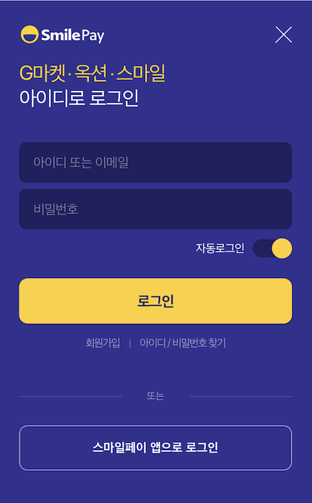

# 스마일페이 일반결제 연동 가이드

본 문서는 스마일페이 관련 내용만 기술하므로 README 파일에서 다음 일반결제 연동 정보를 확인하세요.

- [PC/모바일 웹에서 PG 연동하기 > Callback 방식](../README.md#callback)
- [모바일 앱 WebView에서 PG 연동하기](../README.md#webview)

## 1. PG 설정하기

<a href="https://guide.iamport.kr/8a2de7ab-db8c-4422-be49-ebaf1e5b64ef" target="_blank">스마일페이 일반결제 테스트 모드 설정</a> 페이지의 내용를 참고하여 PG 설정을 합니다.

## 2. 결제 요청하기

[IMP.request_pay(param, callback)](https://docs.iamport.kr/sdk/javascript-sdk#request_pay)을 호출하여 스마일페이 결제창을 호출합니다.

PC와 모바일 모두 `IMP.request_pay(param, callback)` 호출 후 callback으로 실행됩니다.

- `pg` : 등록된 PG사가 하나일 경우에는 미 설정시 `기본 PG사`가 자동으로 적용되며, 여러개인 경우에는 `smilepay`로 지정합니다.
- `pay_method` : 호출 시 선택된 값은 무시되며, 스마일페이 결제창에서 card(신용카드), trans(실시간계좌이체), point(스마일페이) 중 선택한 옵션으로 설정됩니다.

```javascript
IMP.request_pay({
    pg : 'smilepay',
    pay_method : 'card', //생략 가능
    merchant_uid: "order_monthly_0001", // 상점에서 관리하는 주문 번호
    name : '주문명:결제테스트',
    amount : 14000,
    buyer_email : 'iamport@siot.do',
    buyer_name : '구매자이름',
    buyer_tel : '010-1234-5678',
    buyer_addr : '서울특별시 강남구 삼성동',
    buyer_postcode : '123-456'
}, function(rsp) { // callback 로직
	//* ...중략 (README 파일에서 상세 샘플코드를 확인하세요)... *//
});
```  

## 3. 모바일 앱 WebView에서 연동하기

### 3.1 iOS  

ℹ️ 스마일페이 앱으로 결제 승인 후 가맹점 앱으로 복귀하기 위해 설정한 [app_scheme](../README.md#app_scheme) 값을 LGCNS 계약 담당자를 통해 사전 등록하여야 해당 앱스키마를 호출할 수 있습니다.  

스마일페이는 쿠키설정에 따라 다음의 진행 방식을 지원합니다.

- 쿠키 허용 : 웹 또는 앱
- 쿠키 미허용 : 앱 only

쿠키 허용 시, 다음과 같이 웹로그인 또는 앱로그인 중 선택이 가능합니다.  

  


웹로그인의 경우, **자동로그인** 토글 버튼을 활성화 하더라도 다시 해당 페이지로 이동했을때 자동로그인이 해제됩니다. 자동로그인을 유지하기 위해서 다음과 같이 페이지의 문자열화한 내용과 `baseURL`(https://www.mysmilepay.com)로 **WebView.loadHTMLString**를 호출하여 페이지를 로드합니다.

```java
    if (myPG == "smilepay") {
        if let base = URL(string: "https://www.mysmilepay.com") {
            wv.loadHTMLString("<HTML 내용>", baseURL: base)
        }
    }
```

